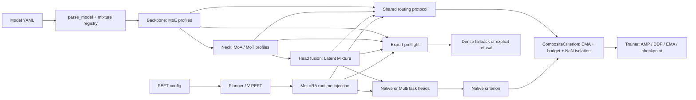

# Changelog

All notable changes to YOLO-Master are documented in this file.

---

## [v26.08] — 2026-08-08

<div align="center">
  <a id="top"></a>
  
  <h1>🎯 YOLO-Master v26.08 Release Notes</h1>
  <p><strong>Ultralytics 8.4.101 · YOLO26 · Mixture Architectures · PEFT · MultiTask · Edge Runtime</strong></p>
  <p>
    <a href="https://github.com/Tencent/YOLO-Master/releases"></a>
    <a href="#validation"></a>
    <a href="#upstream-modernization"></a>
    <a href="https://www.python.org/"></a>
    <a href="https://pytorch.org/"></a>
    <a href="https://github.com/Tencent/YOLO-Master/blob/main/LICENSE"></a>
  </p>
  <p>
    <a href="https://huggingface.co/spaces/gatilin/YOLO-Master-WebUI-Demo"><strong>Live Demo</strong></a> ·
    <a href="https://tencent.github.io/YOLO-Master/"><strong>Documentation</strong></a> ·
    <a href="https://github.com/Tencent/YOLO-Master/tree/main/model-zoo"><strong>Model Zoo</strong></a> ·
    <a href="https://github.com/Tencent/YOLO-Master/discussions"><strong>Discussions</strong></a>
  </p>
</div>

---

## 🌟 Overview

> [!IMPORTANT]
> v26.08 is the cumulative source release after `YOLO-Master-v26.02`. It upgrades the Ultralytics baseline from `8.3.240` to `8.4.101`, keeps mixture and PEFT work additive to native YOLO26 behavior, and turns several formerly independent research paths into governed, testable execution surfaces. The annotated Git tag `v26.08` identifies the exact release commit. Published metrics below are limited to artifacts stored in the repository's model catalog or deployment reports.

<p align="center">
  <br>
  <sub><strong>Figure 1.</strong> Conceptual v26.08 overview: unified tasks, routed architectures, parameter-efficient adaptation, and cross-platform deployment.</sub>
</p>

### Release at a glance

| | |
|---|---|
| **Release range** | `YOLO-Master-v26.02...v26.08` |
| **Audited history** | 634 commits total: 514 non-merge commits and 120 merge commits |
| **Change surface** | 3,353 files changed: 981,877 additions and 23,747 deletions |
| **Upstream upgrade** | Ultralytics `8.3.240` → `8.4.101` |
| **Native model family** | YOLO26 detect · segment · semantic · pose · OBB · classify · YOLOE |
| **Release freeze gate** | 201 passed · 1 xfailed (documented mixture/P0-P2 command) |
| **Model catalog** | 7 evaluated checkpoints · 3 pending/evaluating variants |
| **License** | AGPL-3.0 |

### Release provenance

| Artifact | Canonical value |
|---|---|
| **YOLO-Master source tag** | `v26.08` |
| **Tag target commit** | `1dc71f1da20424a10ebe186e16a7296528756643` |
| **Underlying Python package** | `ultralytics==8.4.101` |
| **Published assets** | `ultralytics-8.4.101-py3-none-any.whl` · `ultralytics-8.4.101.tar.gz` |
| **Historical comparison tag** | `YOLO-Master-v26.02` (`6bed010e3b0f67efbb735470b8c6e3cca65e4e33`) |

The source tag names the YOLO-Master release; it is not a second Python package version. Consumers should resolve the package version from `ultralytics.__version__`, while release provenance and source diffs should resolve through the Git tag and target commit above.

### Why upgrade

- **New upstream foundation:** move from Ultralytics `8.3.240` to `8.4.101` and gain native YOLO26 task, checkpoint, and export contracts.
- **One routing stack:** use a shared protocol for MoE, MoA, MoT, Latent Mixture, and MoLoRA auxiliary losses, temperature scheduling, diagnostics, and export capability reporting.
- **More adaptation paths:** choose fixed-rank LoRA, the architecture-conditioned PEFT Planner, FewShot-LoRA, or routed MoLoRA adapters.
- **Deployment beyond Python:** package models for Windows, Linux, Jetson, and macOS through ONNX Runtime, NCNN, MNN, TensorRT, and Core ML workflows.

[Evolution](#version-evolution) · [Highlights](#key-highlights) · [Quick Start](#quick-start) · [Architecture](#architecture-at-a-glance) · [New Features](#new-features) · [Usage Examples](#usage-examples) · [Model Zoo](#model-zoo-benchmarks) · [Validation](#validation) · [Migration](#migration-guide) · [Development diff](https://github.com/Tencent/YOLO-Master/compare/YOLO-Master-v26.02...v26.08)

> **Canonical release notes:** [`docs/release-notes/v26.08.md`](https://github.com/Tencent/YOLO-Master/blob/v26.08/docs/release-notes/v26.08.md) contains the current P0-P2 hardening summary, validation evidence, migration steps, and known limitations. The Python package identity remains `ultralytics==8.4.101`; `v26.08` is the YOLO-Master source release tag.

---

<a id="version-evolution"></a>

### From v26.02 to v26.08: a framework transition

v26.02 established the original YOLO-Master proposition: ES-MoE conditional computation, standard LoRA fine-tuning, Sparse SAHI, Cluster-Weighted NMS (CW-NMS), and basic MoE loss/pruning tools on the `8.3.240` Ultralytics generation. v26.08 is not a simple accumulation of model blocks. It moves the project from a feature-oriented extension into a routed vision framework with explicit parser, loss, checkpoint, data, export, and validation contracts.

| Concern | v26.02 baseline | v26.08 release position |
|---|---|---|
| **Upstream foundation** | Ultralytics `8.3.240`; early YOLO-Master model variants | Ultralytics `8.4.101` and native YOLO26 task flows; mixture profiles are registered additively and integrity-checked against the upstream baseline |
| **Conditional computation** | ES-MoE, routing choices, balancing loss, and pruning | A shared routing protocol across MoE, MoA, MoT, Latent Mixture, and MoLoRA; dynamic scheduling, diagnostics, shared-expert reuse, sparse/eager boundaries, and loss budgeting |
| **Adaptation** | Fixed-rank configuration-driven LoRA | Standard LoRA remains, with FewShot-LoRA, architecture-conditioned Planner/V-PEFT placement, LOVO validation, and routed MoLoRA adapters with save/load and merge contracts |
| **Task coverage** | Detection-centered model and inference extensions | Native YOLO26 task family remains intact; a preview MultiTask train/validation path adds a release profile for detect, instance segment, and human pose with partial-label protection |
| **Deployment** | Sparse tiled inference and post-processing extensions | Export preflight and a routed backend-capability matrix; documented ONNX Runtime, NCNN, MNN, TensorRT, Core ML, Windows, Linux, Jetson, and macOS integration paths |
| **Operational readiness** | Per-feature tests and scripts | P0-P2 lifecycle hardening for AMP, MPS, DDP, EMA, checkpoints, non-finite recovery, model catalogs, release audits, and Agent contracts |

This distinction matters for adopters: YAML owns architecture choice and expert topology; the PEFT control plane owns adapter placement; the trainer owns routed auxiliary-loss composition and recovery; and export either records a supported routing strategy or selects a declared dense fallback. A module being constructible is therefore no longer treated as evidence of end-to-end accuracy, convergence, or hardware latency.

### Release evolution

| Period | Main evolution | Result carried into v26.08 |
|---|---|---|
| **February 2026** | v26.02 established ES-MoE, standard LoRA, Sparse SAHI, CW-NMS, MoE loss, and pruning as the public baseline. | The original detection, sparse-inference, and fixed-rank-adaptation capabilities remain available. |
| **May to June** | LoRA gained FewShot controls; MoE routing/loss semantics were corrected; MoA and MoT blocks, configurations, tests, and ablation tooling entered the repository. | Conditional computation expanded beyond convolutional experts to routed attention and transformer paths. |
| **Early July** | MoLoRA, LOVO validation, scaling-law tooling, V-PEFT/Planner work, model-profile expansion, and C++ edge examples were added. | PEFT became a separate, architecture-aware planning and adapter-runtime surface rather than only a rank setting. |
| **Mid to late July** | AMP-safe sparse dispatch, DDP/EMA/checkpoint lifecycle fixes, non-finite recovery, export preflight, capability reporting, governance checks, and the `8.4.101` rebase were completed. | Routed features carry explicit numerical, distributed, checkpoint, and export boundaries instead of relying on implicit eager behavior. |
| **Early August** | Shared Expert MoE, Latent Mixture contracts, MultiTask model/trainer/loss/data integration, and portable COCO-aligned smoke profiles were completed. | The release provides model-scoped expert reuse and a scoped detect/segment/pose MultiTask training and validation profile. |

The timeline is drawn from the release range, including the upstream modernization commit (`47a503e`), MoLoRA introduction (`752900f`), MoA/MoT integration (`18527df`), LOVO and V-PEFT work (`917fddc`, `fe3c087`), export governance (`aed6505`, `0d32bd1`), Shared Expert MoE (`82b6ad5`), and MultiTask integration (`31f48ea`, `a7684bd`, `aa5b891`, `a91ec77`). It deliberately summarizes shipped implementation and test scope rather than restating older performance claims as new v26.08 measurements.

---

<a id="key-highlights"></a>

### 🎯 Key Highlights

| Area | Release status | What v26.08 adds |
|---|---|---|
| **Ultralytics 8.4.101 / YOLO26** | **Stable upstream base** | Native task flows, checkpoint compatibility, export integrity, and additive mixture registration |
| **MultiTask** | **Preview** | A YAML-declared detect/segment/pose release profile with optional task-feature routing; additional head branches require matching supervision and validation evidence |
| **Shared Expert MoE** | **Validated component** | Model-scoped expert-pool reuse with cross-model isolation |
| **MoA / MoT** | **Experimental profiles** | Routed attention and transformer blocks, sparse paths, scene-aware routing, and shared temperature scheduling |
| **PEFT Planner / LOVO** | **Opt-in** | Architecture-conditioned placement, V-PEFT solvers, validation, and FewShot-LoRA controls |
| **MoLoRA** | **Opt-in** | Sparse routing over low-rank adapter experts with routing-aware merge contracts |
| **Latent Mixture** | **Experimental profiles** | Dense latent routing, configurable initialization/noise, auxiliary losses, and inference top-k |
| **Edge Runtime** | **Documented integrations** | Windows GUI, ONNX Runtime, NCNN, MNN, Jetson TensorRT, and macOS Core ML workflows; hardware evidence is scoped below |
| **Reliability** | **Release gate** | NaN recovery, DDP checkpoint hardening, EMA synchronization, AMP-safe sparse dispatch, and release audits |

> [!TIP]
> **Status vocabulary:** _Stable upstream base_ follows the project model registry; _validated component_ means focused build/forward/contract tests pass; _preview_ and _experimental profiles_ expose working interfaces without a release-level accuracy claim; _opt-in_ means disabled by default.

---

<a id="quick-start"></a>

## ⚡ Quick Start

### Install from source

```bash
git clone https://github.com/Tencent/YOLO-Master.git
cd YOLO-Master
pip install -e .
yolo version
yolo checks
```

### Train a standard YOLO-Master model

```python
from ultralytics import YOLO

model = YOLO("ultralytics/cfg/models/26/yolo26-master-n.yaml")
model.train(data="coco8.yaml", epochs=100, imgsz=640)
```

### Choose a v26.08 architecture

| If you need… | Start with | Status |
|---|---|---|
| Native YOLO26 behavior | `ultralytics/cfg/models/26/yolo26.yaml` | Stable upstream profile |
| YOLO26 with MoE blocks | `ultralytics/cfg/models/26/yolo26-master-n.yaml` | Experimental; component export verified |
| Joint task training | `ultralytics/cfg/models/26/yolo26-master-mt-n.yaml` | Preview; training/validation focused |
| Shared expert parameters | `ultralytics/cfg/models/master/v0_8/det/yolo-master-moe-mot-shared-n.yaml` | Build/forward/reuse verified |
| Combined attention + transformer routing | `ultralytics/cfg/models/master/v0_10/det/yolo-master-moa-mot-n.yaml` | Experimental; component export/compile verified |
| Latent-space routing | `ultralytics/cfg/models/26/yolo26-master-latent-n.yaml` | Experimental; focused tests verified |
| Routed low-rank adapters | Native `yolo26.yaml` + `molora_*` arguments | Opt-in |

```python
from ultralytics import YOLO

multitask = YOLO(
    "ultralytics/cfg/models/26/yolo26-master-mt-n.yaml",
    task="multitask",
)

shared_moe = YOLO(
    "ultralytics/cfg/models/master/v0_8/det/"
    "yolo-master-moe-mot-shared-n.yaml"
)

moa_mot = YOLO(
    "ultralytics/cfg/models/master/v0_10/det/"
    "yolo-master-moa-mot-n.yaml"
)

latent = YOLO(
    "ultralytics/cfg/models/26/yolo26-master-latent-n.yaml"
)
```

### WebUI preview

The repository-level WebUI provides task selection, image/batch/video/webcam inputs, inference controls, result tables, and Agent-oriented workflows in one interface.

<p align="center">
  <a href="https://huggingface.co/spaces/gatilin/YOLO-Master-WebUI-Demo"></a><br>
  <sub><strong>Figure 2.</strong> YOLO-Master WebUI: task selection, interactive inference controls, visual output, and structured detection results. Click the image to open the live demo.</sub>
</p>

<p align="center">
  <a href="https://huggingface.co/spaces/gatilin/YOLO-Master-WebUI-Demo"><strong>Open the live WebUI demo</strong></a> · <code>python app.py</code> for local launch
</p>

> [!NOTE]
> Shared Expert MoE, MoA/MoT, Latent Mixture, and MultiTask are selected through model YAML files. They are not enabled by undocumented flags such as `moe_shared_expert=True` or `latent_init_perturb=True`.

---

<a id="new-features"></a>
<a id="upstream-modernization"></a>

## 🚀 New Features

### 1️⃣ Ultralytics 8.4.101 and YOLO26 Modernization

v26.02 reported Ultralytics `8.3.240`. v26.08 rebases YOLO-Master on **Ultralytics `8.4.101`** and ports the existing MoE, MoA, MoT, MoLoRA, V-PEFT, and Agent integrations as additive extensions rather than replacing upstream task implementations.

| Compatibility boundary | v26.08 behavior |
|---|---|
| **Official YOLO26 configs** | Native detect, segment, pose, OBB, semantic, classification, and YOLOE YAML files remain available |
| **End-to-end heads** | YOLO26 detection-style heads retain `reg_max=1`, `end2end=True`, and one-to-many/one-to-one branches |
| **Train / predict / val / export** | Native Ultralytics flows remain intact for official YOLO26 models |
| **Mixture models** | Registered as additive YAML profiles instead of overwriting official files |
| **PEFT targeting** | Specialized heads remain excluded unless `lora_include_head=True` is explicitly selected |
| **Checkpoints** | Native fields are preserved; mixture metadata is added without replacing the upstream schema |
| **Integrity boundary** | Official config and backend hashes are recorded in `docs/governance/upstream-v8.4.101-manifest.json` |

The repository includes a deterministic native baseline for eight upstream task configurations—detect, segment, semantic segment, pose, OBB, classification, YOLOE detect, and YOLOE segment—in `reports/migration/v8.4.101-native-baseline.json`.

| Native task | Reference config | Baseline evidence |
|---|---|---|
| Detect | `ultralytics/cfg/models/26/yolo26.yaml` | Build + finite forward |
| Instance segment | `ultralytics/cfg/models/26/yolo26-seg.yaml` | Build + finite forward |
| Semantic segment | `ultralytics/cfg/models/26/yolo26-sem.yaml` | Build + finite forward |
| Pose | `ultralytics/cfg/models/26/yolo26-pose.yaml` | Build + finite forward |
| OBB | `ultralytics/cfg/models/26/yolo26-obb.yaml` | Build + finite forward |
| Classification | `ultralytics/cfg/models/26/yolo26-cls.yaml` | Build + finite forward |
| YOLOE detect | `ultralytics/cfg/models/26/yoloe-26.yaml` | Prompt-aware build + finite forward |
| YOLOE segment | `ultralytics/cfg/models/26/yoloe-26-seg.yaml` | Prompt-aware build + finite forward |

```bash
# Discover additive mixture profiles without replacing native YOLO26 configs.
yolo mixtures kind=mot task=detect
yolo mixtures kind=latent format=json
```

**Migration evidence:** `docs/en/guides/yolo26-mixture-compatibility.md` · `docs/governance/upstream-v8.4.101-manifest.json` · `reports/migration/v8.4.101-native-baseline.json`

---

<a id="architecture-at-a-glance"></a>

### 🧭 Architecture at a Glance

The architecture analysis in this release is organized around four complementary mixture surfaces. A profile may use one surface or compose several through YAML; the table describes the routing contract, not a promise that every profile enables every surface.

| Layer | Component family | Routing object | Typical placement | Current execution boundary |
|---|---|---|---|---|
| Backbone | ES-MoE, gated MoE, Shared Expert MoE | Conv/FFN expert weights, usually Top-K or gated | Backbone feature stages | Eager profiles may dispatch sparsely; expert sharing is model-scoped and isolated across model builds. |
| Neck | MoA | Local, regional, and global attention paths | Neck/FPN attention blocks | Soft mixture keeps all heads available; optional batch-level sparse skipping is opt-in. |
| Neck | MoT | Transformer expert weights over spatial tokens | Neck transformer blocks | Training can retain dense exploration; eager evaluation can use Top-K dispatch. `TaskRouter` is a separate task-affinity router. |
| Head fusion | Latent Mixture | Image-level latent expert probabilities | Multi-scale feature fusion before the task head | Training is dense by design; sparse eager inference is optional and becomes calibration-gated only with `require_inference_calibration=True`; export uses the declared dense fallback. |
| PEFT | MoLoRA | Adapter-expert Top-K weights | Runtime injection around selected `Linear`/`Conv2d` layers | Base weights remain available; save/load and merge semantics are explicit and standard LoRA is mutually exclusive with enabled MoLoRA. |



#### Build and control plane

- `ultralytics/nn/tasks.py` keeps the upstream parser as the model-construction entry point. `mixture_registry.py` resolves additive YAML names, adapts channels/repeats, and records YAML provenance; official YOLO26 YAML files are not overwritten.
- The forward path publishes routed auxiliary losses through `ultralytics/nn/modules/routing_protocol.py`. `CompositeCriterion` collects each routed family once, applies per-family EMA normalization and gains, enforces the global auxiliary budget, and isolates non-finite families before adding them to native task loss.
- MultiTask uses `MultiTaskHead` plus `TaskRouter` for task/shared feature gating. `MultiTaskBatchSampler` controls source proportions and persists its state for deterministic resume; it does not turn missing labels into negative targets.
- PEFT is a separate control plane: the Planner/V-PEFT produces placement decisions, then MoLoRA injects adapter experts without changing the YAML topology. This is distinct from per-sample forward routing.

#### Architecture boundaries to keep explicit

> [!IMPORTANT]
> **Routing is not task selection.** MoT provides shared visual representation. `TaskRouter` computes per-token affinity and applies task/shared feature gates to every YAML-enabled branch; YAML plus the dataset contract decide which branches are built and supervised. Neither router chooses one final task output at inference time.

- Latent Mixture defaults to `value_fusion_mode="router_only"`: auxiliary inputs affect routing probabilities but are not automatically fused as expert values. Use `weighted_sum` explicitly when value fusion is intended.
- Routed export is not equivalent to eager sparse execution. The capability matrix and preflight choose a declared dense fallback for tracing/ONNX-style backends unless a backend explicitly advertises preserved routing.
- The architecture analysis covers implementation structure and focused contracts. It does not establish end-to-end accuracy gains, multi-epoch convergence, NCCL stability, or universal hardware latency.

**Implementation map:** `ultralytics/nn/tasks.py` · `ultralytics/nn/mixture_registry.py` · `ultralytics/nn/modules/routing_protocol.py` · `ultralytics/nn/mixture_loss.py` · `ultralytics/data/multitask_sampler.py` · `ultralytics/nn/peft/molora/` · `ultralytics/utils/export_preflight.py`

**Full report:** [YOLO-Master Deep Architecture Analysis](YOLO-Master-Deep-Analysis.md) — source-level module walkthrough, routing semantics, YAML integration, and implementation index.

---

### 2️⃣ MultiTask and Routed Architecture Highlights

<details open>
<summary><strong>MultiTask Learning — one feature hierarchy, configurable task branches</strong></summary>

`MultiTaskHead` combines a shared backbone and neck with task-specific branches. `TaskRouter` is optional and performs content-based spatial-token routing between task-specific and shared features.

```text
                     Shared Backbone + Neck
                               │
                      Optional TaskRouter
                               │
        ┌──────────┬─────────┬──────┬──────────┬───────┬─────┐
        │ Detect   │ Segment │ Pose │ Classify │ Depth │ OBB │
        └──────────┴─────────┴──────┴──────────┴───────┴─────┘
```

| Component | Role |
|---|---|
| `MultiTaskHead` | Builds branches enabled by the model and dataset task lists |
| `TaskRouter` | Routes spatial tokens to task and shared feature channels |
| `MultiTaskLoss` | Combines losses only for tasks with valid supervision |
| Unified data path | Preserves missing supervision instead of converting it to negative targets |

```bash
yolo multitask train \
  model=ultralytics/cfg/models/26/yolo26-master-mt-n.yaml \
  data=ultralytics/cfg/datasets/coco-multitask-unified.yaml \
  epochs=100 \
  imgsz=640
```

> [!NOTE]
> The shipped MultiTask YAML and COCO-unified dataset declare **detection, instance segmentation, and human pose**. The `MultiTaskHead` can construct other branch types, but the trainer rejects a selected branch unless its dataset, criterion, and validation contract are present; MultiTask OBB remains non-trainable. The current `multitask` prediction map uses `DetectionPredictor`; a public `tasks=[...]` multi-output inference API is not documented in this release.

**Implementation:** `ultralytics/nn/modules/multitask/` · `ultralytics/models/yolo/multitask/` · `ultralytics/nn/tasks.py`

</details>

<details open>
<summary><strong>Shared Expert MoE — model-scoped parameter reuse</strong></summary>

`SharedExpertMoE` uses `pool_id` to share one `fused_experts` module across compatible blocks built as part of the same model. Model parsing clears the temporary registry at model boundaries, so separately constructed models do not share parameters or devices.

```yaml
backbone:
  - [-1, 1, SharedExpertMoE, [512, 4, 2, 0.5, 8, 1.2, 0.5, 1.0, 1.0, 0.01, 8, 2, 0.5, "p3_p4"]]
  - [-1, 1, SharedExpertMoE, [512, 4, 2, 0.5, 8, 1.2, 0.5, 1.0, 1.0, 0.01, 8, 2, 0.5, "p3_p4"]]
```

The v0.8 shared model now uses the current `C2fMoT` argument order (`num_heads=8`, `top_k=2`). Regression tests verify model construction, a minimal forward pass, in-model object reuse, and cross-model isolation.

> [!NOTE]
> Source comments estimate a 25–50% reduction in expert parameters when sharing applies. v26.08 does not publish that estimate as a measured end-to-end model result.

**Implementation:** `ultralytics/nn/modules/moe/shared_expert_moe.py` · `ultralytics/nn/tasks.py` · `ultralytics/cfg/models/master/v0_8/det/yolo-master-moe-mot-shared-n.yaml`

</details>

<details>
<summary><strong>3. MoA and MoT — routed attention and transformer experts</strong></summary>

**Mixture of Attention (MoA).** MoA combines local, regional, and global attention paths behind a router.

| Setting | Purpose |
|---|---|
| `moa_local_window_size` | Local attention window size |
| `moa_regional_max_kv_tokens` | Regional key/value token cap |
| `moa_sparse_inference` | Skip low-weight head groups during evaluation |
| `moa_sparse_inference_threshold` | Sparse-evaluation threshold |

**Mixture of Transformers (MoT).** MoT routes spatial tokens through transformer-style experts.

| Setting | Purpose |
|---|---|
| `mot_balance_loss` | GShard balance-loss coefficient |
| `mot_router_z_loss` | Router z-loss coefficient |
| `mot_sparse_train` | Sparse expert dispatch during training |
| `mot_scene_aware_router` | Experimental scene-aware routing branch |

```python
from ultralytics import YOLO

model = YOLO(
    "ultralytics/cfg/models/master/v0_10/det/"
    "yolo-master-moa-mot-n.yaml"
)
model.train(
    data="coco8.yaml",
    epochs=100,
    moa_sparse_inference=False,
    mot_balance_loss=0.01,
    moa_mot_temperature_factor=0.97,
    moa_mot_min_temperature=0.3,
)
```

**Implementation:** `ultralytics/nn/modules/moa/` · `ultralytics/nn/modules/mot/` · `ultralytics/nn/modules/routing_protocol.py`

</details>

<details>
<summary><strong>4. PEFT Planner, LOVO, and FewShot-LoRA</strong></summary>

`PEFTPlanner` evaluates model structure and returns an `ACCEPT`, `ADAPT`, or `REFUSE` placement decision. The V-PEFT backend provides `ao`, `dco`, and `mip` budget solvers.

```python
from ultralytics import YOLO

model = YOLO("yolo26n.pt")
model.train(
    data="coco8.yaml",
    epochs=100,
    lora_r=16,
    lora_planner_enabled=True,
    lora_adapter_budget=500_000,
    lora_planner_solver="ao",
    lora_planner_backend="vpeft",
)
```

LOVO is a Python API rather than a `yolo lora lovo` CLI command:

```python
from ultralytics.utils.lora import LOVODataCollector, LOVOValidator

collector = LOVODataCollector.load("reports/lovo_data.json")
result = LOVOValidator().validate(collector)
result.save("reports/lovo_validation.json")
```

FewShot-LoRA adds scheduled DropConnect, optional teacher distillation, and variational rank selection:

```python
model.train(
    data="fewshot.yaml",
    epochs=200,
    lora_r=16,
    lora_few_shot_mode=True,
    lora_few_shot_dropconnect_schedule="cosine",
    lora_few_shot_dropconnect_max=0.3,
    lora_few_shot_distill_weight=0.5,
    lora_few_shot_variational_rank=True,
)
```

**Implementation:** `ultralytics/utils/lora/planner.py` · `ultralytics/vpeft/graph.py` · `ultralytics/utils/lora/fallback.py`

</details>

<details>
<summary><strong>5. MoLoRA — routed low-rank adapter experts</strong></summary>

MoLoRA adds sparse routing over multiple low-rank adapter experts. It includes balance, z, and diversity losses; expert dropout and warmup; optional domain mappings; expert freezing; and routing-aware merge contracts.

```python
from ultralytics import YOLO

model = YOLO("yolo26n.pt")
model.train(
    data="coco8.yaml",
    epochs=100,
    molora_num_experts=4,
    molora_top_k=2,
    molora_r=8,
    molora_alpha=16,
    molora_router_type="linear",
)
```

`molora_num_experts=0` disables MoLoRA. A positive standard `lora_r` request and `molora_num_experts>0` cannot be used together.

**Implementation:** `ultralytics/nn/peft/molora/` · `ultralytics/engine/extensions/adapters.py`

</details>

<details>
<summary><strong>6. Latent Mixture — dense latent-space routing</strong></summary>

`LatentMixture` projects one or more feature maps into a shared latent space, routes them through channel experts, and publishes balance and router z-loss terms through the common routing protocol.

```python
from ultralytics import YOLO

model = YOLO(
    "ultralytics/cfg/models/26/"
    "yolo26-master-latent-n-initperturb020-temp05.yaml"
)
model.train(
    data="coco8.yaml",
    epochs=100,
    latent_inference_top_k=2,
    moa_mot_temperature_factor=0.97,
    moa_mot_min_temperature=0.3,
)
```

The selected YAML uses `router_init_std=0.02` and `temperature=0.5`. The shared mixture extension applies a multiplicative temperature schedule with a configured floor. Ablation configs under `ultralytics/cfg/models/26/` cover router initialization, temperature, noise, and residual initialization.

**Implementation:** `ultralytics/nn/modules/latent_mixture.py` · `ultralytics/nn/modules/routing_protocol.py` · `ultralytics/engine/extensions/mixture.py`

</details>

---

### 3️⃣ Cross-Platform Edge Deployment

The cross-platform example combines a shared C++ runtime with platform-specific applications and packaging workflows.

> [!IMPORTANT]
> The table below describes repository integrations and target platforms, not a blanket backend-certification claim. The Jetson result is the only hardware benchmark published here; routed-profile TensorRT and the current Core ML environment remain outside the validated release surface.

| Backend | Repository integration | Primary targets |
|---|---|---|
| **ONNX Runtime** | C++ backend + Windows GUI | Linux and Windows, CPU/CUDA |
| **NCNN** | C++ backend + Windows GUI | x86 and ARM, Vulkan where available |
| **MNN** | C++ backend + Windows GUI | x86 and ARM, OpenCL where available |
| **TensorRT** | Native C++ backend + Jetson scripts | NVIDIA GPU and Jetson Orin |
| **Core ML** | Export scripts + Swift application | macOS on Apple Silicon and Intel |

#### 🖥️ Windows GUI

The Windows 10/11 application uses Dear ImGui and Direct3D 11. It supports image, folder, video, and webcam input; segmentation overlays; backend switching; and live confidence/IoU controls.

<p align="center">
  <br>
  <sub><strong>Figure 3.</strong> Native Windows Runner processing a dense aerial scene with the ONNX Runtime CUDA backend.</sub>
</p>

The cross-platform edge and reproduction work includes merged contributions for the C++ ONNX/NCNN/MNN runtime ([#97](https://github.com/Tencent/YOLO-Master/pull/97)), Jetson TensorRT deployment ([#105](https://github.com/Tencent/YOLO-Master/pull/105)), the macOS Core ML runner ([#134](https://github.com/Tencent/YOLO-Master/pull/134)), and the Windows GUI ([#176](https://github.com/Tencent/YOLO-Master/pull/176)). [View all PRs by `skywalker-lt`](https://github.com/Tencent/YOLO-Master/pulls?q=is%3Apr+author%3Askywalker-lt+).

```powershell
cd examples/YOLO-Master-Cross-Platform-Edge-Deployment/gui
./build.ps1
./build.ps1 -Run
```

The build requires Visual Studio 2022, CMake 3.16 or newer, and at least one configured inference backend. Packaging copies required runtime DLLs beside `yolomaster_gui.exe`.

#### 📊 Verified Jetson Result

| Device | Backend | Precision | Dataset/model scope | Latency | FPS | mAP50-95 |
|---|---|---:|---|---:|---:|---:|
| Jetson Orin Nano 4 GB | TensorRT | FP16 | Documented VisDrone model, 548-image validation | 27.8 ms | 35.7 | 0.2029 |

The corresponding PyTorch FP32 baseline is `0.2036` mAP50-95. These values apply only to the model, data, and device documented in `examples/YOLO-Master-Cross-Platform-Edge-Deployment/jetson/DEPLOYMENT_LOG.md`.

> [!NOTE]
> `cpu_threads` and `cpu_affinity` are not Python `YOLO.predict()` arguments in v26.08.

---

## 🛠 Improvements & Fixes

### 🛡️ Reliability and Recovery

| Area | v26.08 change | Verification scope |
|---|---|---|
| **NaN handling** | Pre-batch checks, component guards, and recovery paths | Routed training and recovery regression tests |
| **AMP safety** | Dtype-aligned sparse accumulation | MoE/MoA/MoT mixed-precision tests |
| **DDP lifecycle** | Bootstrap and pre-epoch checkpoint coordination | DDP lifecycle and static-graph tests |
| **EMA** | Buffer and PEFT scaling synchronization | Checkpoint/EMA regression tests |
| **MPS** | Native bilinear `grid_sample` path and numerical fixes | Apple Silicon regression tests |
| **Export** | Routed capability matrix and pruning metadata | Export and pruning contract tests |
| **Upstream integrity** | Ultralytics `8.4.101` file manifest, native baseline, and additive registry | Integrity, checkpoint, and model-registry tests |
| **Agent runtime** | Profile manifests, release audits, and structured fallback | Agent quick/contract validation suites |

### Selected critical fixes

| PR | Fix |
|---:|---|
| [#74](https://github.com/Tencent/YOLO-Master/pull/74) | ONNX export compatibility for MoE expert loss |
| [#116](https://github.com/Tencent/YOLO-Master/pull/116) | P0/P1/P2 fixes across MoE, MoA, MoT, and PEFT |
| [#124](https://github.com/Tencent/YOLO-Master/pull/124) | AMP dtype alignment for sparse `index_add_` paths |
| [#127](https://github.com/Tencent/YOLO-Master/pull/127), [#140](https://github.com/Tencent/YOLO-Master/pull/140) | DDP static-graph and checkpoint coordination |
| [#158](https://github.com/Tencent/YOLO-Master/pull/158) | Released router checkpoint compatibility |
| [#161](https://github.com/Tencent/YOLO-Master/pull/161) | YOLOE released-checkpoint execution semantics |
| [#162 (merge)](https://github.com/Tencent/YOLO-Master/commit/9a93a786d2c3a35af506e2bc8121b07f5dd00586) | GitHub Actions pinned to commit SHAs |
| [#177](https://github.com/Tencent/YOLO-Master/pull/177) | LoRA alpha warmup across the EMA lifecycle |
| [#188](https://github.com/Tencent/YOLO-Master/pull/188) | Routing dataset statistics weighted by sample count |
| [#192](https://github.com/Tencent/YOLO-Master/pull/192), [#194](https://github.com/Tencent/YOLO-Master/pull/194) | Pruned expert architecture preserved for retraining |
| [#211](https://github.com/Tencent/YOLO-Master/pull/211) | PEFT scaling state synchronized to EMA |

---

### P0-P2 hardening delivered in this release

The following corrections are verified by focused build, forward, serialization, or contract tests. They describe implementation readiness, not full-dataset convergence, production throughput, or multi-node behavior.

| Priority | Area | Correction |
|---|---|---|
| P0 | Routing and auxiliary loss | A single routing facade collects auxiliary loss once, preserves detached diagnostics, and isolates non-finite routed-loss families. |
| P0 | Checkpoint, EMA, and DDP lifecycle | Bootstrap/pre-epoch checkpoint coordination and PEFT/EMA scaling synchronization are covered by lifecycle regressions. |
| P0 | Export contracts | Export preflight checks module/backend declarations and records sparse versus dense strategy, fallback, and performance caveats. |
| P1 | MultiTask data path | `MultiTaskBatchSampler` supports deterministic weighted or round-robin sampling, DDP rank interleaving, and resumable state; partial labels are loss-masked. |
| P1 | AMP, MPS, and sparse dispatch | Sparse accumulation aligns dtypes, MPS uses the native-safe bilinear sampling path, and NaN recovery is synchronized across ranks. |
| P1 | Latent Mixture | Named YAML configuration, checkpoint provenance, value-fusion selection, and an optional calibration gate for sparse eager inference prevent parser/config drift. |
| P2 | PEFT and observability | MoLoRA fallback adapters round-trip through save/load and routing snapshots expose stable diagnostics for integration work. |

For the implementation-to-evidence mapping and remaining audit items, see [`docs/release-notes/v26.08.md`](https://github.com/Tencent/YOLO-Master/blob/v26.08/docs/release-notes/v26.08.md).

---

<a id="usage-examples"></a>

## 💡 Usage Examples

<details open>
<summary><strong>🧩 Example 1: MultiTask training</strong></summary>

```bash
yolo multitask train \
  model=ultralytics/cfg/models/26/yolo26-master-mt-n.yaml \
  data=ultralytics/cfg/datasets/coco-multitask-unified.yaml \
  epochs=100 \
  imgsz=640
```

</details>

<details>
<summary><strong>🎯 Example 2: Architecture-conditioned PEFT</strong></summary>

```python
from ultralytics import YOLO

model = YOLO("ultralytics/cfg/models/26/yolo26.yaml")
model.train(
    data="coco8.yaml",
    epochs=100,
    lora_r=16,
    lora_planner_enabled=True,
    lora_adapter_budget=500_000,
    lora_planner_solver="ao",
    lora_planner_backend="vpeft",
)
```

</details>

<details>
<summary><strong>🖥️ Example 3: Interactive and native runners</strong></summary>

```bash
# Local Gradio WebUI
python app.py
```

```powershell
# Native Windows GUI
cd examples/YOLO-Master-Cross-Platform-Edge-Deployment/gui
./build.ps1 -Run
```

</details>

---

<a id="model-zoo-benchmarks"></a>

## 📊 Model Zoo & Benchmarks

### YOLO-Master-EsMoE

| Model | Params | GFLOPs | mAP50-95 | FPS¹ | Assets |
|---|---:|---:|---:|---:|---|
| **EsMoE-N** | 2.68M | 8.7 | 0.427 | 640.18 | [Weights](https://huggingface.co/gatilin/YOLO-Master-ckpts-v0/resolve/main/YOLO-Master-EsMoE-N/YOLO-Master-EsMoE-N.pt?download=true) · [YAML](https://github.com/Tencent/YOLO-Master/blob/main/ultralytics/cfg/models/master/v0_10/det/yolo-master-n.yaml) |
| **EsMoE-S** | 9.69M | 29.1 | 0.489 | 423.87 | [Weights](https://huggingface.co/gatilin/YOLO-Master-ckpts-v0/resolve/main/YOLO-Master-EsMoE-S/YOLO-Master-EsMoE-S.pt?download=true) · [YAML](https://github.com/Tencent/YOLO-Master/blob/main/ultralytics/cfg/models/master/v0_10/det/yolo-master-s.yaml) |
| **EsMoE-M** | 34.88M | 97.4 | 0.530 | 243.79 | [Weights](https://huggingface.co/gatilin/YOLO-Master-ckpts-v0/resolve/main/YOLO-Master-EsMoE-M/YOLO-Master-EsMoE-M.pt?download=true) · [YAML](https://github.com/Tencent/YOLO-Master/blob/main/ultralytics/cfg/models/master/v0_10/det/yolo-master-m.yaml) |
| **EsMoE-L** | _evaluating_ | — | — | — | [YAML](https://github.com/Tencent/YOLO-Master/blob/main/ultralytics/cfg/models/master/v0_10/det/yolo-master-l.yaml) |
| **EsMoE-X** | _pending_ | — | — | — | [YAML](https://github.com/Tencent/YOLO-Master/blob/main/ultralytics/cfg/models/master/v0_10/det/yolo-master-x.yaml) |

### YOLO-Master-v0.1

| Model | Params | GFLOPs | mAP50-95 | FPS¹ | Assets |
|---|---:|---:|---:|---:|---|
| **v0.1-N** | 7.54M | 10.1 | 0.429 | 528.84 | [Weights](https://huggingface.co/gatilin/YOLO-Master-ckpts-v0_1/resolve/main/YOLO-Master-v0.1-N/YOLO-Master-v0.1-N.pt?download=true) · [YAML](https://github.com/Tencent/YOLO-Master/blob/main/ultralytics/cfg/models/master/v0_1/det/yolo-master-n.yaml) |
| **v0.1-S** | 29.15M | 36.0 | 0.489 | 345.24 | [Weights](https://huggingface.co/gatilin/YOLO-Master-ckpts-v0_1/resolve/main/YOLO-Master-v0.1-S/YOLO-Master-v0.1-S.pt?download=true) · [YAML](https://github.com/Tencent/YOLO-Master/blob/main/ultralytics/cfg/models/master/v0_1/det/yolo-master-s.yaml) |
| **v0.1-M** | 52.17M | 116.7 | 0.528 | 170.72 | [Weights](https://huggingface.co/gatilin/YOLO-Master-ckpts-v0_1/resolve/main/YOLO-Master-v0.1-M/YOLO-Master-v0.1-M.pt?download=true) · [YAML](https://github.com/Tencent/YOLO-Master/blob/main/ultralytics/cfg/models/master/v0_1/det/yolo-master-m.yaml) |
| **v0.1-L** | 58.41M | 138.1 | 0.539 | 149.86 | [Weights](https://huggingface.co/gatilin/YOLO-Master-ckpts-v0_1/resolve/main/YOLO-Master-v0.1-L/YOLO-Master-v0.1-L.pt?download=true) · [YAML](https://github.com/Tencent/YOLO-Master/blob/main/ultralytics/cfg/models/master/v0_1/det/yolo-master-l.yaml) |
| **v0.1-X** | _evaluating_ | — | — | — | [YAML](https://github.com/Tencent/YOLO-Master/blob/main/ultralytics/cfg/models/master/v0_1/det/yolo-master-x.yaml) |

<details>
<summary><strong>Full precision, recall, and mAP50 metrics</strong></summary>

| Model | P | R | mAP50 | mAP50-95 |
|---|---:|---:|---:|---:|
| EsMoE-N | 0.684 | 0.536 | 0.587 | 0.427 |
| EsMoE-S | 0.699 | 0.603 | 0.603 | 0.489 |
| EsMoE-M | 0.737 | 0.640 | 0.697 | 0.530 |
| v0.1-N | 0.684 | 0.542 | 0.592 | 0.429 |
| v0.1-S | 0.724 | 0.607 | 0.662 | 0.489 |
| v0.1-M | 0.729 | 0.641 | 0.696 | 0.528 |
| v0.1-L | 0.739 | 0.646 | 0.705 | 0.539 |

</details>

<sub>¹ FPS values are the RTX 4090 results recorded in `model-zoo/models.json` (updated 2026-07-22). Dataset and evaluation fields follow that catalog. L/X results and PEFT efficiency figures are not published because matching evaluated artifacts are not available.</sub>

### 🤝 Community Model Contributions

We welcome reproducible model submissions. A model PR should include:

1. externally hosted weights;
2. the exact training YAML and command;
3. dataset and evaluation protocol;
4. precision, recall, mAP, latency, and hardware details;
5. logs or curves sufficient to reproduce the result.

See [CONTRIBUTING.md](https://github.com/Tencent/YOLO-Master/blob/main/CONTRIBUTING.md) before opening a pull request.

---

<a id="validation"></a>

## ✅ Validation

The release-focused gate covers the corrected Shared Expert path, routed architecture contracts, and the P0-P2 hardening surface. The command below is the historical architecture subset; the current focused totals and system gates are listed in the table.

```bash
pytest \
  tests/test_moe.py \
  tests/test_moa.py \
  tests/test_mot.py \
  tests/test_mixture_aux_loss.py \
  tests/test_routing_aux_contract.py \
  tests/test_master_model_configs.py \
  tests/test_default_config_integrity.py \
  tests/test_mixture_catalog.py \
  tests/test_upstream_integrity.py \
  tests/test_checkpoint_compat.py \
  tests/test_mixture_model_registry.py -q
```

Run the P0-P2 regression groups before publishing a build:

```bash
pytest -q \
  tests/test_routed_module_protocol.py tests/test_routing_diagnostics.py \
  tests/test_molora_merge_semantics.py tests/test_p2_fixes.py \
  tests/test_latent_mixture.py tests/test_mixture_loss_composition.py \
  tests/test_mixture_model_registry.py tests/test_export_capability_matrix.py \
  tests/test_multitask.py tests/test_mot.py tests/test_mixture_export.py \
  tests/test_routing_aux_contract.py tests/test_mixture_aux_loss.py \
  tests/test_moe_router_boundaries.py tests/test_molora_vpeft_integration.py \
  tests/test_vpeft.py
python agent/scripts/validate_yolo_master_skill.py --suite quick --pretty --summary-only
```

| Gate | Result |
|---|---:|
| MoE, MoA, and MoT modules | Passed |
| Routed auxiliary-loss contracts | Passed |
| Shared Expert build, forward, reuse, and isolation | Passed |
| Master model configuration regression | Passed |
| Default configuration integrity | Passed |
| Mixture catalog integrity | Passed |
| Ultralytics `8.4.101` upstream integrity | Passed |
| Checkpoint conversion and compatibility | Passed |
| Additive mixture model registry | Passed |
| **Mixture/P0-P2 focused gate** | **201 passed · 1 xfailed** |
| **MultiTask + Latent + P0 system gates** | Included in the focused gate above |
| **Agent Skill quick suite** | **36/36 passed** |

Static release-note checks also verify referenced repository paths, Python syntax, registered configuration keys, model catalog parity, and patch whitespace.

> [!NOTE]
> This is a **targeted release gate**, not the repository's entire test suite. It covers the features and compatibility claims promoted in these notes.

The release-freeze result was generated from the command printed above on the tagged release candidate. The `xfailed` case is retained as an explicit expected failure; it is not counted as a pass.

### Verification boundaries

- Routed model profiles remain experimental unless the model registry marks them stable.
- MultiTask training and validation are implemented; task-specific multi-output prediction beyond the detection predictor remains preview functionality.
- MoA/MoT, Latent Mixture, MoLoRA, and FewShot-LoRA do not have release-level accuracy or latency tables because matching evaluated artifacts are not stored in the repository.
- TensorRT export remains unverified for the routed profiles listed in `docs/governance/model-registry.yaml`; component-level ONNX round trips do not imply full-model TensorRT validation.
- No CUDA/MPS AMP multi-epoch run or real NCCL two-GPU training result is recorded in this release audit; DDP evidence is lifecycle and contract focused.
- Core ML validation is blocked in the current macOS environment by a `coremltools`/SciPy binary loading issue.
- Repository-wide Ruff findings remain outside the touched release surface, principally in `agent/`, `scripts/`, and legacy helper modules.
- EsMoE-L, EsMoE-X, and v0.1-X remain pending or under evaluation.

---

<a id="migration-guide"></a>

## 🔄 Migration Guide

### From v26.02 to v26.08

<details>
<summary><strong>🔧 Click to view detailed migration steps</strong></summary>

> [!IMPORTANT]
> **Breaking changes:** none are formally declared for v26.08. Existing fixed-rank LoRA calls and the documented `sparse_sahi`, `lora_auto_r_ratio`, and `moe_balance_loss` settings remain registered. Custom code that imports Ultralytics internals should still be retested against the new `8.4.101` baseline.

#### Upgrade impact by workflow

| Existing v26.02 workflow | v26.08 behavior | Required upgrade action |
|---|---|---|
| Native detection or an existing official YOLO integration | The parser, trainer, task heads, checkpoints, and export flow now follow the `8.4.101` baseline. | Retest code that imports Ultralytics internals; keep native YOLO26 YAML files unchanged for the upstream baseline. |
| ES-MoE model YAML | Expert topology and routing are YAML-owned; routed auxiliary losses pass through the shared loss protocol. | Keep the YAML with its checkpoint, and validate custom expert or router modules with the routing-boundary tests before reuse. |
| Fixed-rank LoRA | Standard `lora_r` and `lora_alpha` training remains supported. | Keep the existing call; opt into Planner/V-PEFT only when a placement policy is wanted. |
| LoRA plus a new routed adapter experiment | MoLoRA is a separate adapter-expert runtime with dedicated save/load and merge semantics. | Select either standard LoRA or MoLoRA. A positive `lora_r` and `molora_num_experts > 0` are intentionally rejected together. |
| Sparse SAHI or CW-NMS inference | The original registered settings remain available; they are not silently converted into routed-model deployment guarantees. | Preserve the existing inference configuration and benchmark the full model/backend combination in the target environment. |
| Exporting a mixture profile | Eager sparse execution and exported behavior can differ by backend. | Run export preflight and consult the capability matrix; accept the documented dense fallback or an explicit refusal rather than assuming sparse routing is preserved. |
| MultiTask experimentation | The release profile supports detect, instance segment, and human pose training/validation with partial-label masks. | Use `task="multitask"` and the supplied COCO-unified contract; provide data, criterion, and validation support before enabling other branches. MultiTask OBB training is rejected. |
| Resume/checkpoint integration | Native checkpoint fields are retained and mixture/PEFT state is carried as additive metadata. | Retest resume and EMA behavior with the target configuration; do not replace native checkpoint fields with custom routing metadata. |

#### Upstream baseline: `8.3.240` → `8.4.101`

The main migration is an upstream Ultralytics upgrade, not only a feature addition. Existing YOLO-Master mixture and adapter methods were ported onto the `8.4.101` parser, trainer, checkpoint, task-head, and export contracts.

- Use the packaged YOLO26 YAML files for the new native model family.
- Keep mixture architectures additive; do not replace official `yolo26*.yaml` files.
- Preserve native checkpoint fields when converting old artifacts; the project adds `mixture_checkpoint` metadata separately.
- Revalidate custom integrations that depended directly on the old `8.3.240` parser, trainer lifecycle, or internal head signatures.
- Use `tools/migration/check_upstream_integrity.py` and `tests/test_upstream_integrity.py` when rebasing further upstream changes.

```bash
# Confirm that the active checkout, import path, and CLI resolve to v8.4.101.
python -c "import ultralytics; print(ultralytics.__version__, ultralytics.__file__)"
yolo version
yolo checks
```

#### Existing LoRA calls remain valid

```python
from ultralytics import YOLO

model = YOLO("ultralytics/cfg/models/26/yolo26.yaml")
model.train(
    data="coco8.yaml",
    epochs=100,
    lora_r=16,
    lora_alpha=32,
)
```

#### Enable the PEFT Planner explicitly

```python
from ultralytics import YOLO

model = YOLO("ultralytics/cfg/models/26/yolo26.yaml")
model.train(
    data="coco8.yaml",
    lora_r=16,
    lora_planner_enabled=True,
    lora_planner_backend="vpeft",
    lora_planner_solver="ao",
)
```

#### Enable MoLoRA with a positive expert count

```python
from ultralytics import YOLO

model = YOLO("ultralytics/cfg/models/26/yolo26.yaml")
model.train(
    data="coco8.yaml",
    molora_num_experts=4,
    molora_top_k=2,
    molora_r=8,
)
```

> [!WARNING]
> Do not combine a positive standard `lora_r` request with `molora_num_experts>0`; the adapter extension rejects the ambiguous request.

### Compatibility notes

- PRs [#158](https://github.com/Tencent/YOLO-Master/pull/158) and [#161](https://github.com/Tencent/YOLO-Master/pull/161) preserve released router and YOLOE checkpoint behavior. There is no `legacy_routing` argument.
- MoLoRA merge semantics have dedicated regression tests. There is no `molora_compat` argument.
- On macOS, the Agent runtime prefers MPS when available and no device is specified. Set `runtime.device` or disable `runtime.prefer_mps` to force CPU execution.

</details>

---

## 🤝 Community & Contributors

Thanks to every contributor who shaped this release. Commit counts below follow the audited release range and retain Git author identities as recorded.

| Contributor | Recorded contribution | Focus |
|---|---:|---|
| **isLinXu** | 364 commits | Project direction, MoE architecture, DDP hardening, release integration |
| **Hertz** | 102 commits | MoA/MoT integration and mixture optimization |
| **gatilin** | 24 commits | Agent system and release management |
| **13ewat3r** | 15 commits | MoA tests and vertical validation |
| **kimariyb** | 15 commits | MoT hybrid architecture and domain LoRA |
| **Thomas** | 13 commits | Project contributions across the release range |
| **SidKC** | 12 commits | LoRA/V-PEFT lifecycle and routing dataset fixes |
| [**skywalker-lt**](https://github.com/Tencent/YOLO-Master/pulls?q=is%3Apr+author%3Askywalker-lt+) | 9 merged PRs | Cross-platform edge deployment and reproduction workflows |

Additional contributions came from **Lfan-ke**, **vankari**, **delei-kong**, **Cooryn**, **Ricky-7-Yan**, **Zviolin**, and the wider YOLO-Master community.

### Community Links

- [Documentation site](https://tencent.github.io/YOLO-Master/)
- [GitHub Wiki](https://github.com/Tencent/YOLO-Master/wiki)
- [Model Zoo](https://github.com/Tencent/YOLO-Master/tree/main/model-zoo)
- [Discussions](https://github.com/Tencent/YOLO-Master/discussions)
- [Issues and feature requests](https://github.com/Tencent/YOLO-Master/issues)
- [Development diff from v26.02](https://github.com/Tencent/YOLO-Master/compare/YOLO-Master-v26.02...v26.08)

---

## 🙏 Acknowledgments

We thank the Ultralytics team for the `8.4.101` upstream release, the research community behind MoE, LoRA, SAHI, and GShard, and every contributor, tester, and user who helped harden this release. YOLO-Master v26.08 carries its mixture, PEFT, multi-task, Agent, and deployment extensions forward from the older `8.3.240` baseline.

---

## 📄 License

YOLO-Master is released under the [GNU Affero General Public License v3.0](https://github.com/Tencent/YOLO-Master/blob/main/LICENSE). Commercial use may require a separate Ultralytics license.

---

## 📞 Contact & Support

- **Issues:** [GitHub Issues](https://github.com/Tencent/YOLO-Master/issues)
- **Discussions:** [GitHub Discussions](https://github.com/Tencent/YOLO-Master/discussions)
- **Email:** [gatilin@tencent.com](mailto:gatilin@tencent.com) · [islinxu@163.com](mailto:islinxu@163.com)

---

<div align="center">

### 🌟 Star History

[](https://star-history.com/#Tencent/YOLO-Master&Date)

[View the complete star history](https://star-history.com/#Tencent/YOLO-Master&Date)

**Made with ❤️ by the YOLO-Master Team**

<p><a href="#top">Back to top ↑</a></p>

</div>

---

## [YOLO-Master-v26.02] — 2026-02-13

- Based on Ultralytics `8.3.240`.
- Added LoRA support for model training.
- Established the Mixture-of-Experts module foundation.
- Added Sparse SAHI inference.
- Added Cluster-Weighted NMS (CW-NMS).
- Added MoE auxiliary-loss support.
- Added MoE pruning and analysis tools.

[View the v26.02 release](https://github.com/Tencent/YOLO-Master/releases/tag/YOLO-Master-v26.02)
