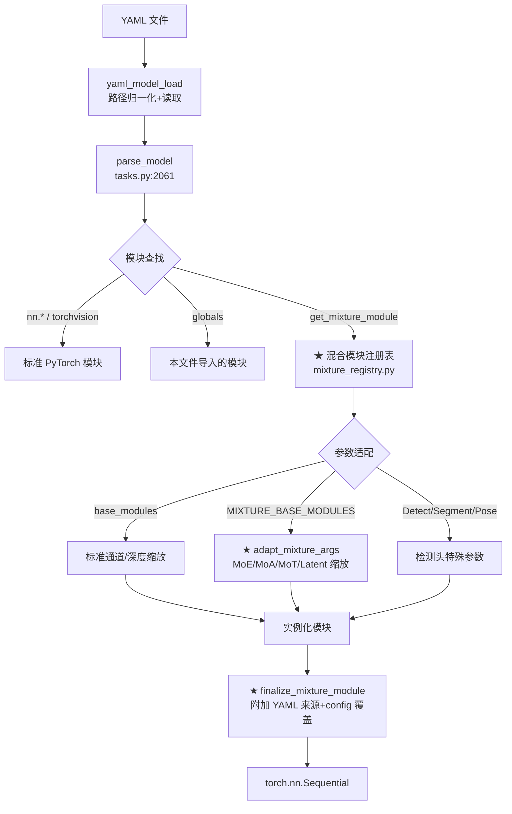
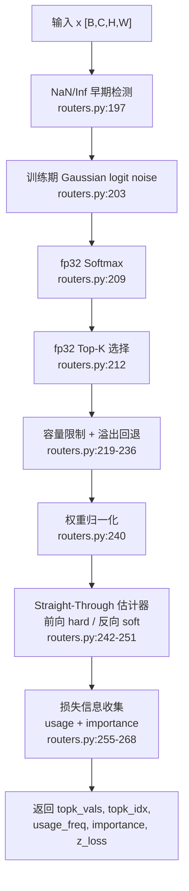
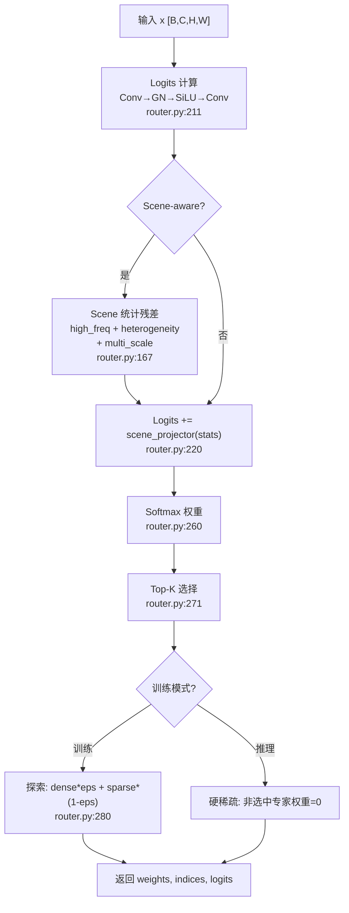
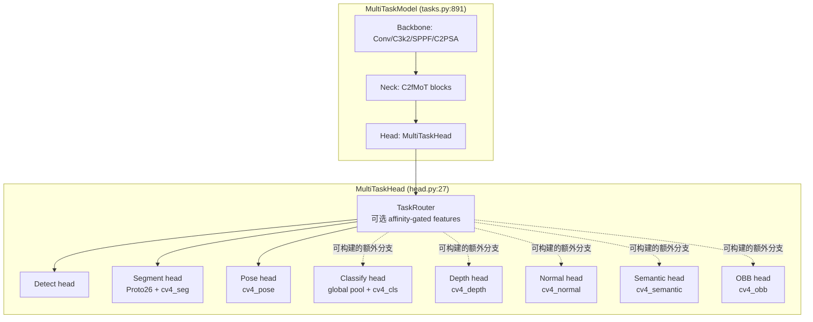
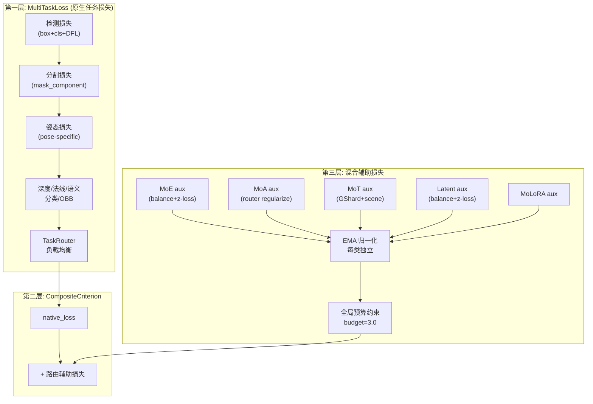
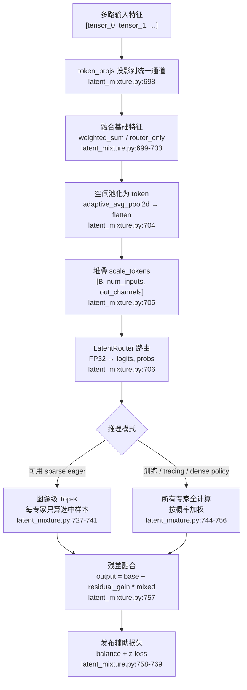
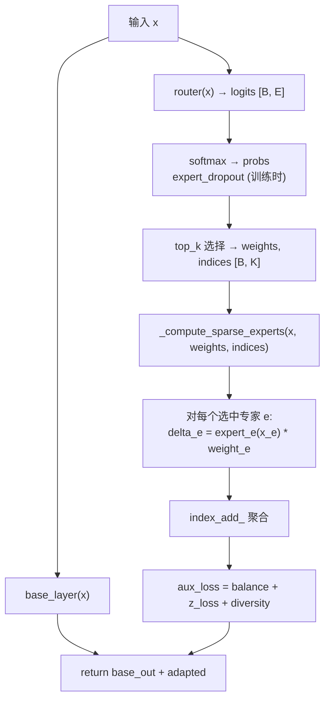
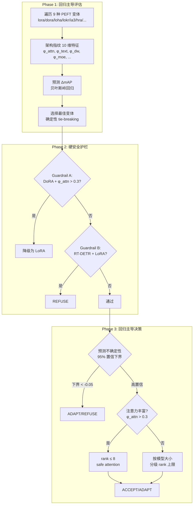

# YOLO-Master 深度架构分析报告

> **报告类型**：源码导向的架构审阅（source-trace analysis）
> **项目**：YOLO-Master — 基于 Ultralytics YOLO 的路由式视觉模型扩展框架
> **检查基线**：当前工作区 `YOLO-Master-v260804-latest`（2026-08-08）
> **覆盖范围**：ES-MoE、MoA、MoT、Latent Mixture、MoLoRA、PEFT Planner、V-PEFT、MultiTask 与路由基础设施

> [!IMPORTANT]
> 本报告说明实现结构、配置边界与源码可追溯路径，不构成准确率、收敛性、NCCL 多节点稳定性或通用硬件延迟结论。YAML 中“可构建”的分支不等于已有完整的监督、验证或发布级评测证据；v26.08 的发布边界以 [`docs/release-notes/v26.08.md`](docs/release-notes/v26.08.md) 为准。

> [!NOTE]
> 文中的文件与行号针对上述快照。源码持续演进时，行号可能漂移；应以组件名、相对路径和相邻代码语义进行复核。

---

## 目录

- [1. 整体架构总览](#1-整体架构总览)
- [2. MoE — Mixture of Experts 核心模块](#2-moe--mixture-of-experts-核心模块)
- [3. MoA — Mixture of Attentions](#3-moa--mixture-of-attentions)
- [4. MoT — Mixture of Transformers 与多任务训练](#4-mot--mixture-of-transformers-与多任务训练)
- [5. Latent MoE — 潜在空间混合专家](#5-latent-moe--潜在空间混合专家)
- [6. PEFT / MoLoRA / Planner / V-PEFT](#6-peft--molora--planner--v-peft)
- [7. 统一基础设施：路由协议与混合损失](#7-统一基础设施路由协议与混合损失)
- [8. 与原始 Ultralytics YOLO 的差异对比](#8-与原始-ultralytics-yolo-的差异对比)
- [9. 关键代码索引](#9-关键代码索引)

---

## 1. 整体架构总览

### 1.1 项目定位

YOLO-Master 在 Ultralytics YOLO 上叠加四个路由式模型表面（MoE / MoA / MoT / Latent Mixture），并提供独立的路由式适配器表面（MoLoRA）。`TaskRouter` 则是 MultiTask 头中的可选特征门控组件，而不是第五种最终任务选择器。

| 表面 | 放置位置 | 运行时语义 |
|---|---|---|
| MoE | Backbone / 可选模块 | 按模块配置在 FFN 或卷积专家间进行 Top-K 路由。 |
| MoA、MoT | Neck | MoA 混合 local / regional / global 注意力；MoT 混合 Transformer 专家。 |
| Latent Mixture | Head 前的多尺度融合 | 所有输入都会形成路由 token；默认只把第一路输入作为 value base。 |
| MultiTask `TaskRouter` | MultiTaskHead | 对每个启用任务生成亲和度门控的任务特征，并注入共享特征。 |
| MoLoRA | 选定 `Linear` / `Conv2d` 周围 | 在低秩适配器专家之间进行样本级 Top-K 路由。 |

### 1.2 架构全景图

```
┌─────────────────────────────────────────────────────────────────────────┐
│                         YOLO-Master Model                               │
│                    (tasks.py: BaseModel → parse_model)                   │
│                                                                         │
│  ┌─────────────────────────────────────────────────────────────────┐    │
│  │              torch.nn.Sequential (parse_model 构建)             │    │
│  │                                                                 │    │
│  │  Backbone                    Neck                    Head       │    │
│  │  ┌──────────┐            ┌──────────┐          ┌──────────┐    │    │
│  │  │Conv/C3k2 │            │ Upsample │          │          │    │    │
│  │  ├──────────┤            ├──────────┤          │ Detect   │    │    │
│  │  │A2C2fMoE  │◄── MoE     │ C2fMoA   │◄── MoA  │ Segment  │    │    │
│  │  │ (P3/P4/  │   (FFN     │ (Neck    │   (Attn  │ Pose     │    │    │
│  │  │  P5)     │   专家)    │  P4/P5)  │   路由)  │ 其他可选 │    │    │
│  │  ├──────────┤            ├──────────┤          │ YAML 任务│    │    │
│  │  │C2PSA     │            │ C2fMoT   │◄── MoT   │ MultiTask│    │    │
│  │  └──────────┘            │ (Neck    │   (Trans │  Head    │    │    │
│  │                           │ YAML 位  │   专家)  └──────────┘    │    │
│  │                           ├──────────┤                          │    │
│  │                           │LatentMix │◄── Latent                │    │
│  │                           │ (Head前  │   (多尺度                │    │
│  │                           │  融合)   │   特征路由)              │    │
│  │                           └──────────┘                          │    │
│  └─────────────────────────────────────────────────────────────────┘    │
│                                                                         │
│  ┌─────────────────────────────────────────────────────────────────┐    │
│  │              Loss System (mixture_loss.py)                      │    │
│  │                                                                 │    │
│  │  Native Loss          +         Routed Aux Loss                 │    │
│  │  ┌──────────────┐              ┌──────────────────────┐         │    │
│  │  │Det/Seg/Pose/ │              │ CompositeCriterion   │         │    │
│  │  │Cls/Depth/    │              │  (EMA归一化+预算约束) │         │    │
│  │  │Normal/Sem    │              │ MoE/MoA/MoT/Latent/  │         │    │
│  │  └──────────────┘              │ MoLoRA aux loss      │         │    │
│  │                                └──────────────────────┘         │    │
│  └─────────────────────────────────────────────────────────────────┘    │
│                                                                         │
│  ┌─────────────────────────────────────────────────────────────────┐    │
│  │              PEFT Layer (peft/molora/)                          │    │
│  │  动态包裹 Conv2d/Linear 层，不改变模型 YAML 拓扑                  │    │
│  │  MoLoRALayer → MoLoRAExpert × N → Router (Top-K)                │    │
│  │  Planner (回归预测) + V-PEFT (约束求解) 决定注入策略              │    │
│  └─────────────────────────────────────────────────────────────────┘    │
└─────────────────────────────────────────────────────────────────────────┘
```

### 1.3 模块目录结构

```
ultralytics/nn/
├── tasks.py                        # ★ 模型构建主文件 (YAML → PyTorch Model)
├── mixture_registry.py             # ★ 混合模块注册表（当前 24 个映射）
├── mixture_loss.py                 # ★ 混合损失组合器
├── modules/
│   ├── __init__.py                 #   统一导出 (256行)
│   ├── block.py                    #   基础块 (C2f, A2C2f, C3k2, C2PSA)
│   ├── conv.py / head.py / transformer.py
│   ├── routing_protocol.py         # ★ 路由协议 (aux_loss 发布/收集)
│   ├── latent_mixture.py           # ★ Latent MoE (855行)
│   ├── moe/                        # ★★ MoE 核心（当前 31 个顶层 Python 模块）
│   │   ├── modules.py              #    MoE 块实现 (1825行)
│   │   ├── routers.py              #    路由器 (531行)
│   │   ├── experts.py              #    专家网络
│   │   ├── gated.py                #    门控 MoE 家族
│   │   ├── pruning.py              #    专家剪枝 (712行)
│   │   ├── scheduler.py            #    Gini 驱动动态调度
│   │   ├── loss.py                 #    MoE 损失函数
│   │   ├── config.py               #    统一配置解析
│   │   ├── shared_expert_moe.py    #    跨尺度专家共享
│   │   └── analysis.py / diagnostics.py / hooks.py / ...
│   ├── moa/                        # ★★ MoA 包（7 个顶层 Python 模块）
│   │   ├── block.py                #    MoABlock 核心
│   │   ├── heads.py                #    3 种注意力头
│   │   ├── router.py               #    MoA 路由器
│   │   └── wrappers.py             #    C2fMoA / NeckMoAFusion
│   ├── mot/                        # ★★ MoT 包（7 个顶层 Python 模块）
│   │   ├── block.py                #    MoTBlock 核心
│   │   ├── experts.py              #    3 个 Transformer 专家
│   │   ├── router.py               #    MoT 路由器
│   │   └── wrappers.py             #    C2fMoT
│   └── multitask/                  # ★ 多任务头
│       ├── head.py                 #    MultiTaskHead（最多 8 类分支）
│       └── router.py               #    TaskRouter
└── peft/
    └── molora/                     # ★ MoLoRA（8 个顶层 Python 模块）
        ├── layer.py                #    MoLoRALayer (883行)
        ├── model.py                #    模型注入/合并 (915行)
        ├── config.py / router.py / loss.py / utils.py
        └── moe_aware.py            #    MoE 感知扩展
```

### 1.4 模型构建流程

`parse_model()`（当前 `tasks.py:2061`）将 YAML 配置解析为 PyTorch 模型。下图只描述标准与 mixture 模块的解析路径；`MultiTaskHead` 另有按 YAML `tasks` 组装参数的分支。



**混合模块注册表** (`mixture_registry.py:39-64`) 在当前快照中注册了 24 个模块名到类的映射，使 MoE/MoA/MoT 模块能通过 YAML 名称直接引用：

```python
MIXTURE_MODULES = {
    "A2C2fMoE": A2C2fMoE, "ES_MOE": ES_MOE,
    "C2fMoA": C2fMoA, "C2fMoT": C2fMoT,
    "LatentMixture": LatentMixture, "SharedExpertMoE": SharedExpertMoE,
    # ... 当前共 24 个
}
```

---

## 2. MoE — Mixture of Experts 核心模块

### 2.1 路由器体系

MoE 的核心是路由器——决定每个 token 由哪些专家处理。下图列出当前代码中的代表性路由器；不同 MoE 包装器会选用不同路由和分发策略：

```
nn.Module
├── UltraEfficientRouter (routers.py:60)      — DWConv + 8× 下采样（源码注释给出相对局部路由的 FLOPs 估算）
├── BaseRouter (routers.py:168)                — 带容量因子的基类
│   ├── EfficientSpatialRouter (routers.py:272)
│   ├── AdaptiveRoutingLayer (routers.py:316)
│   └── LocalRoutingLayer (routers.py:342)
├── DynamicRoutingLayer (routers.py:433)       — ES_MOE 专用, ONNX兼容
├── ZeroCostRouter (gated.py:938)              — 零开销: 复用 BN 统计量
├── DualStreamGateRouter (gated.py:82)         — 双流: 全局统计+局部卷积
│   └── DualStreamGateRouterV2 (gated.py:181)  — +LayerNorm+专家先验偏置
└── LatentRouter (latent_mixture.py:133)       — Latent MoE 专用, 始终 FP32
```

#### 核心路由流程（以 BaseRouter 为例）

`routers.py:185-269` 的 `_process_logits` 方法实现了完整的路由流水线：



**容量因子机制** (`routers.py:178-182, 219-237`):
- 容量计算: `capacity = ceil(capacity_factor * B * top_k / num_experts)`
- 使用 `one_hot + cumsum` 追踪每专家分配量
- 溢出 token 回退到专家 0，通过 straight-through 估计器保持梯度

**UltraEfficientRouter 的实现取舍** (`routers.py:60-165`):
- `avg_pool2d(pool_scale=8)` 将路由特征图的面积降为原来的约 1/64
- 深度可分离卷积路由: DWConv → GroupNorm → SiLU → PW 压缩 → Expert 投影
- Logit 钳位: `clamp(-30, 30)` 防止溢出
- Z-loss 计算: `logsumexp(scaled_logits)² .mean()` 防止路由器 logit 爆炸

### 2.2 专家网络

为适应 Top-K 分发后的小批量甚至单样本路径，主要的稀疏专家族（`SimpleExpert`、`SpatialExpert`、`InvertedResidualExpert`、`SharedInvertedExpertGroup`）使用 **GroupNorm**。这不是对整个专家目录的统一约束：`DepthwiseSeparableConv` 与 `EfficientExpertGroup` 仍包含 BatchNorm 路径。

| 专家类 | 文件:行 | 结构 | 特点 |
|--------|---------|------|------|
| `OptimizedSimpleExpert` | `experts.py:12` | 1x1→GN→SiLU→1x1→GN | 基础专家，expand_ratio=2 |
| `FusedGhostExpert` | `experts.py:37` | primary_conv + cheap_op → concat | Ghost 模式，减少内存流量 |
| `SpatialExpert` | `experts.py:91` | 1x1→GN→SiLU→3x3 DW→GN→SiLU→1x1→GN | 学习空间模式 |
| `InvertedResidualExpert` | `experts.py:148` | 1x1 Expand→3x3 DW→1x1 Project | MobileNetV2 风格；速度优势需以目标硬件实测为准 |
| `SharedInvertedExpertGroup` | `experts.py:179` | 共享 expand+DW + 独立 1x1 投影头 | 稀疏分发只计算被选中头 |
| `FusedExpertGroup` | `gated.py:1003` | 融合为大卷积核 | 一次卷积计算所有专家 |
| `DenseChannelExpert` | `latent_mixture.py:108` | 1x1→GN→SiLU→3x3 DW→GN→SiLU→1x1 | Latent MoE 专用，末层 init std=1e-3 |

#### FusedExpertGroup 的核心优化

`gated.py:1003-1098` 将所有专家的卷积核融合为单个大卷积：

```python
# 一次卷积计算所有专家: [B, E*OC, H, W]
fused_out = self.fused_conv(x)  # gated.py:1063
# Reshape 为 [B, E, OC, H, W]
fused_out = fused_out.view(B, E, OC, H, W)  # gated.py:1066
# Top-K gather 先于归一化 — 只对选中专家做 GN/SiLU
# 向量化 GroupNorm — 无 Python 循环
```

### 2.3 MoE 块变体对比

下表列出具有代表性的 MoE 块变体，覆盖不同的路由、共享和融合实现：

| MoE 块 | 路由器 | 专家 | 共享专家 | 特点 |
|--------|--------|------|----------|------|
| `ES_MOE` | DynamicRoutingLayer | EfficientExpertGroup (异构核) | 无 | 简洁通用，ONNX 兼容 |
| `UltraOptimizedMoE` | UltraEfficientRouter | OptimizedSimpleExpert/FusedGhost | 是 | 超轻量路由，batched 稀疏 |
| `AdaptiveGateMoE` | DualStreamGateRouter | SharedInvertedExpertGroup | SE-gated | 双流路由 + 温度退火 |
| `HyperFusedMoE` | ZeroCostRouter | FusedExpertGroup | shared_path | 零开销路由 + 融合卷积 |
| `UltimateOptimizedMoE` | UltraLightRouter | MatMulFusedExperts | 静态路径 | 动态温度 + 熵损失 |
| `SharedExpertMoE` | DualStreamGateRouter | LowRankFusedExpertGroup (共享) | SE-gated | **跨尺度专家池共享** |
| `A2C2fMoE` | 继承 ABlockMoE | 可选 | 是 | **Area-Attention + MoE-FFN** |
| `LatentMixture` | LatentRouter (FP32) | DenseChannelExpert | base_proj | **多输入特征融合** |

### 2.4 专家剪枝机制

`pruning.py`（当前 712 行）实现了加载、诊断、规划、手术、保存和验证的六步剪枝流程：


**评分机制** (`pruning.py:54-72`):
- `"usage"` 模式: 纯命中率 `hits / total_hits`
- `"usage_weight"` 模式: 命中率 × 平均路由权重，区分等频但权重不同的专家

**YAML 同步** (`pruning.py:415-468`): 剪枝后应将新的 `num_experts` 写入 `model.yaml`。否则 `YOLO(pruned.pt).train()` 可能从 YAML 重建原专家数，导致 `intersect_dicts` 因形状不匹配丢弃剪枝后的权重。

### 2.5 负载均衡损失

`loss.py` 实现了生产级的五项组合损失：

| 损失项 | 公式 | 作用 |
|--------|------|------|
| Balance Loss | `N * Σ(importance * usage)` | 防止路由器偏向某些专家 |
| Z-Loss | `mean(logsumexp(logits)²)` | 约束 logits 幅度防溢出 |
| Entropy Loss | `-Σ(p * log(p))` | 防止路由器犹豫不决 |
| Diversity Loss | 专家输出对的 cosine_sim² | 鼓励正交专家 |
| Variance Loss | `mean((usage - 1/N)²)` | 直接惩罚使用方差 |

DDP 感知: `_get_global_statistics` (`loss.py:202-257`) 将 importance sum + count + expert counts 打包成一次 `all_reduce` 调用。

### 2.6 动态调度

| 调度器 | 文件:行 | 机制 |
|--------|---------|------|
| `MoEDynamicScheduler` | `scheduler.py:44` | Gini 驱动: `coeff = base * (1 + gain * (ema_gini - target))` |
| `MapSaturationScheduler` | `scheduler.py:151` | mAP 饱和退火: plateau 时 `scale *= 0.8` |

---

## 3. MoA — Mixture of Attentions

### 3.1 核心设计

MoA（`moa/block.py:20`）将每个空间 token **软路由**到 local、regional、global 三组异构注意力头，覆盖从细粒度到场景语义的不同感受野：

| 组名 | 头类 | 感受野 | 复杂度 | 功能 |
|------|------|--------|--------|------|
| local | `_LocalAttnHead` | 窗口内 (win²) | O(N·win²) | 细粒度细节、纹理 |
| regional | `_RegionalAttnHead` | 池化 KV (stride-2) | O(N²/4) | 中程上下文、物体关系 |
| global | `_GlobalAttnHead` | 全局（小 token 数时精确 SDPA；大 token 数时线性近似） | O(N) 近似路径 | 场景语义、全局上下文 |

**与 MoE 的核心区别**：MoA 默认是**软路由**（所有组按 softmax 权重混合）；若显式打开 `sparse_inference`，eager eval 可按批次跳过全局低权重组。MoE 则通常使用 Top-K 路由，具体稀疏分发方式取决于模块与执行环境。

### 3.2 路由器设计

`moa/router.py:22` 的 `_MoARouter(FP32RouterMixin, nn.Module)` 使用 FP32 softmax，并由 `MixtureRuntimeController` 在 epoch 边界统一退火温度。

```python
# router.py:34-39 — 路由网络结构
self.router = nn.Sequential(
    nn.Conv2d(dim, hidden, 1, bias=False),         # 1x1 降维
    nn.GroupNorm(num_groups, hidden),
    nn.SiLU(inplace=False),
    nn.Conv2d(hidden, num_groups, 1, bias=True),   # 输出 [B, 3, H, W]
)
# 最后一层权重和偏置初始化为零 → 训练初期路由接近均匀
```

**温度退火**: 温度从 1.0 开始，每 epoch 乘以 0.97，下限 0.3 (`router.py:110-123`)。由训练器的 `MixtureRuntimeController` 在每个 epoch 结束时统一调用。

### 3.3 三种注意力头详解

#### Local Attention — 窗口分区自注意力 (`heads.py:111-155`)

- Swin 风格窗口分区：每个 token 仅在 `window_size × window_size` 邻域内注意
- DW 3x3 偏置 QKV 分离
- 位置编码：DW 7x7 卷积加到 value 上
- 支持非整除情况下的 padding

#### Regional Attention — 池化 KV 注意力 (`heads.py:157-235`)

- 对 K/V 进行 stride-2 自适应平均池化，降低 KV 分辨率
- 查询保持全分辨率，KV 降采样到 H/2 × W/2
- 动态步幅：当 KV token 数超过 4096 时自动加倍步幅
- H=1 或 W=1 时跳过池化（安全保护）

#### Global Attention — Performer 式线性注意力 (`heads.py:237-367`)

- 用随机傅里叶特征近似 softmax，将 O(N²) 降为 O(N)
- 正交随机特征：通过 QR 分解生成正交基，存为 persistent buffer
- ReLU 核函数：`F.relu(x) + eps`，非负稳定
- 混合模式：N≤512 用精确 SDPA，N∈[448,512] 平滑混合，N>512 纯线性

### 3.4 YAML 集成

MoA 通过 `C2fMoA` 包装器 (`moa/wrappers.py:40`) 替换 Neck 中的 C3k2，可直接替换：

```yaml
# yolo26-master-moa-n.yaml:25 — 替代标准 C3k2
- [-1, 2, C2fMoA, [512, 3, 2.0, 1.0, True]]
# 参数: c2=512, num_heads=3, mlp_ratio=2.0, temperature=1.0, shortcut=True
```

**放置策略**: MoA 主要部署在 Neck 的 P4/P5 层（语义密集，需全局上下文），P3 浅层通常保留标准卷积（关注局部细节）。

### 3.5 MoA vs 标准 Multi-Head Attention

| 维度 | 标准 MHA | MoA |
|------|----------|-----|
| 头类型 | 全部相同（全局自注意力） | 三种异构（local/regional/global） |
| 头分配 | 固定均分 | 动态路由（每 token 不同权重） |
| 感受野 | 全局 O(N²) | 混合（O(N·win²) + O(N²/4) + O(N)） |
| KV 计算 | 全分辨率 | 窗口/池化下采样/随机特征 |
| 路由开销 | 无 | 1x1 Conv + GN + SiLU + 1x1 Conv |
| 残差 | 标准 | LayerScale (0.1 init) + 残差 |

---

## 4. MoT — Mixture of Transformers 与多任务训练

### 4.1 两级路由架构

YOLO-Master 的 MoT 系统由**两个独立但协作的层面**组成：

```
┌─────────────────────────────────────────────────────┐
│  Neck 级: MoTBlock (Mixture-of-Transformers)       │
│  3 个异构 Transformer 专家 (LocalConv/Window/Def)   │
│  → 为多任务学习提供自适应特征表示                     │
├─────────────────────────────────────────────────────┤
│  Head 级: TaskRouter（可选特征门控）                 │
│  ByteTracker 启发的任务亲和度设计                    │
│  → 为 YAML 启用的任务支路产生 gated task/shared 特征 │
└─────────────────────────────────────────────────────┘
```

**边界**：MoT 不直接选择视觉任务，而是提供共享的视觉表示。`TaskRouter` 同样不选择一个最终任务输出：它按 token 计算任务亲和度，为每个已启用的 head 分支生成任务特征并注入共享特征。实际构建与监督哪些分支由模型 YAML 和数据集合同共同决定。

### 4.2 MoTBlock — 三个 Transformer 专家

`mot/block.py:21` 定义三类 Transformer 专家。训练与 eager eval 的实际 sparse / dense dispatch 还取决于 `top_k`、训练设置和 DDP 合同：

| 专家 | 文件:行 | 注意力机制 | 特点 |
|------|---------|-----------|------|
| `_LocalConvTransformerExpert` | `experts.py:72` | DW-3x3 卷积偏置注意力 | 局部纹理、快速推理 |
| `_WindowTransformerExpert` | `experts.py:174` | Swin 风格窗口 + 位移窗口 | 中程结构、物体边界 |
| `_DeformableTransformerExpert` | `experts.py:318` | MS-Deformable-DETR 稀疏采样 | 非规则形状、形变物体 |

#### MoT 路由器 (`mot/router.py:61`)



**Scene 一致性损失**（`router.py:194-209`）：当 scene-aware router 启用时，KL 散度将 Local / Window / Deformable 的平均路由概率对齐到由高频、异质性和多尺度统计构造的目标分布；它提供偏好信号，而非硬性专家分派规则。

### 4.3 多任务系统架构



`MultiTaskHead` 可构建 8 类视觉分支：`detect`、`segment`、`pose`、`classify`、`depth`、`normal`、`semantic`、`obb`。当前 v26.08 的发布 YAML `yolo26-master-mt-n.yaml` 只声明 `detect / segment / pose`，并与 `coco-multitask-unified.yaml` 的 COCO 对齐数据合同配套；MultiTask OBB 训练会被显式拒绝，其他额外分支也必须具备完整的数据、criterion 和 validator 合同。

### 4.4 TaskRouter — 任务路由器

`multitask/router.py:61` 的接口借鉴 ByteTracker 的两阶段关联语义，但当前实现的实际控制流是 Top-K 亲和度稀疏化（训练期保留 2% dense exploration），而非一条显式的置信度阈值硬分流路径：

```python
# 计算 token → task 亲和度并做 Top-K 稀疏化
affinity = F.softmax(affinity_logits / temperature, dim=1)  # router.py:158
topk_vals, topk_idx = affinity.topk(self._top_k, dim=1)     # router.py:162

# 任务特征按 affinity 加权；共享特征会注入每个 enabled branch
task_features = x.unsqueeze(1) * affinity.unsqueeze(2)       # router.py:177
shared_features = self.cross_task_proj(x)[:, :shared_channels] # router.py:181

# head 侧将 task + shared 投影回每个 FPN scale
routed_task = routed_task + importance * shared_feats         # head.py:274
features.append(xi + importance * routed_task)                # head.py:277
```

### 4.5 多任务训练流程

#### 数据加载

```
MultiTaskTrainer.get_dataloader()                          # train.py:286
  → build_dataset() → COCOMultiTaskDataset                 # dataset.py:340
  → 可选: MultiTaskBatchSampler + TaskRoutedDataset        # train.py:297
```

- `COCOMultiTaskDataset`: 从 COCO JSON 加载对齐的 sparse 目标（检测/分割/姿态），可选加载 dense 目标（深度/法线/语义）
- `MultiTaskBatchSampler`: 仅当数据 YAML 显式配置非空 `task_sources` 时启用；支持 `weighted` 与 `round_robin`，并具有 DDP 感知。
- 缺失监督用 `valid=False` 或 `ignore_index=255` 表示

#### 三层损失聚合



**默认任务权重**（`loss.py:1480`，亦由 `tasks.py:846` 的 `MULTITASK_TASK_WEIGHT_DEFAULTS` 定义）：
```python
{"detect": 1.0, "segment": 0.5, "pose": 1.0, "classify": 0.3,
 "depth": 0.3, "normal": 0.3, "semantic": 0.5, "obb": 0.5}
```

**源感知损失跳过** (`loss.py:1531`): 当 batch 来自 `TaskRoutedDataset` 时，`task_source` 标签决定哪些任务损失被计算，避免无标签任务的噪声梯度。

### 4.6 MoE/MoA/MoT 共存的 YAML 配置

项目支持三种混合系统在同一个模型中共存：

| 配置文件 | Backbone | Neck | Head |
|----------|----------|------|------|
| `yolo26-master-mt-n.yaml` | 标准 | C2fMoT (全层) | MultiTaskHead |
| `yolo26-master-moa-mot-n.yaml` | 标准 | P3 MoA + P4/P5 MoT | Detect |
| `yolo-master-moe-mot-shared-n.yaml` | SharedExpertMoE | C2fMoT | Detect |
| `yolo26-master-latent-n.yaml` | A2C2fMoE | 标准 | LatentMixture + Detect |
| `yolo-master-moa-mot-n.yaml` (v0.10) | VisualEnhancedAdaptiveGateMoE | P3 MoA + P4/P5 MoT | Detect |

---

## 5. Latent MoE — 潜在空间混合专家

### 5.1 与传统 MoE 的区别

`latent_mixture.py`（当前 855 行）实现了多尺度特征融合阶段的潜在空间路由。需要区分**路由 token 的聚合**和**value 特征的融合**：所有输入都会参与 router token，默认 `value_fusion_mode="router_only"` 则只以第一路输入经 `base_proj` 作为 value base；只有 `weighted_sum` 才会显式加权融合各路 value 特征。

| 特性 | 传统 MoE (ES_MOE 等) | Latent MoE |
|------|---------------------|------------|
| 输入 | 单特征图 `[B, C, H, W]` | 多对齐特征列表 `[Tensor, ...]` |
| 路由维度 | 空间/通道统计 | 潜在空间 token |
| 路由器精度 | 混合精度 | **始终 FP32** |
| 专家计算 | 稀疏 Top-K (训练+推理) | 密集（训练）+ 可选稀疏（推理） |
| 残差 | 内部 add | **可学习 `residual_gain`**（冷启动 0） |
| 集成位置 | Backbone | **Head（多尺度特征融合）** |

### 5.2 LatentMixture 前向流程

`latent_mixture.py:711-770`:



### 5.3 冷启动安全设计

- **`residual_gain` 初始为 0**: 冷启动时输出 = base（不干扰主干），`latent_mixture.py:506`
- **`expert_head` 权重和偏置初始化为零**: 保证初始路由均匀，`latent_mixture.py:176-177`
- **稀疏 eager 推理条件**：仅在 `eval`、`inference_top_k < num_experts` 且非 tracing / ONNX export 时可进入 sparse dispatch。`require_inference_calibration` 默认是 `False`；只有将其设为 `True` 时，`calibrate_inference()` 记录的相对 L2 误差必须不超过 tolerance，未通过则回退 dense，`latent_mixture.py:584-757`。

> [!TIP]
> 若要把稀疏 eager 与 dense 输出的偏差纳入部署准入，应显式启用 `require_inference_calibration=True` 并保存校准报告；默认配置不会把校准作为必经门。

### 5.4 YAML 集成

LatentMixture 是**多输入模块**，接收多个 FPN 尺度的特征进行跨尺度融合：

```yaml
# yolo26-master-latent-n.yaml:39-41
- [[16, 4], 1, LatentMixture, [256, 4, 0.25, null, 1.0, 0.01, 0.001, 0.0, 0.0]]
# 接收 layer 16 和 4 的输出 → 融合为 P3 尺度特征
- [[19, 13, 6], 1, LatentMixture, [512, 4, 0.25, null, 1.0, 0.01, 0.001, 0.0, 0.0]]
# 接收 3 路输入 → 融合为 P4 尺度特征
- [[22, 10, 8], 1, LatentMixture, [1024, 4, 0.25, null, 1.0, 0.01, 0.001, 0.0, 0.0]]
# 接收 3 路输入 → 融合为 P5 尺度特征
# 参数: [out_ch, num_experts, expert_ratio, router_hidden, temp, bal_coeff, z_coeff, residual_init, noise]
```

---

## 6. PEFT / MoLoRA / Planner / V-PEFT

### 6.1 PEFT 系统架构

```
┌──────────────────────────────────────────────────────────────┐
│                    PEFT 系统架构                              │
│                                                              │
│  ┌──────────────────┐  ┌──────────────┐  ┌───────────────┐  │
│  │  PEFTPlanner     │  │  V-PEFT      │  │  MoLoRA       │  │
│  │  (回归规划器)     │  │  Compiler    │  │  (MoE+LoRA)   │  │
│  │                  │  │              │  │               │  │
│  │  12维贝叶斯回归  │──│  计算图构建  │──│  N个LoRA专家  │  │
│  │  硬安全护栏      │  │  约束求解    │  │  Top-K路由器  │  │
│  │  LOVO交叉验证    │  │  放置计划    │  │  辅助损失     │  │
│  └──────────────────┘  └──────────────┘  └───────────────┘  │
│         │                      │                  │          │
│         └──────────┬───────────┘                  │          │
│                    ▼                              ▼          │
│           apply_lora() ──── 注入 LoRA/MoLoRA ────┘          │
└──────────────────────────────────────────────────────────────┘
```

### 6.2 MoLoRA — LoRA 与 MoE 路由的结合

`nn/peft/molora/layer.py:129` 将 base layer 包装为 **N 个 LoRA 专家 + Top-K 路由器**；base layer 是否可训练由注入配置决定，不能概括为始终冻结：



**三种主要计算路径**：
1. **批量向量化路径**（`layer.py:696`）：当 `K == num_experts`、rank 对齐且可安全批处理时，以 `einsum` 计算全部 Linear 专家。
2. **小批量向量化 Linear 路径**（`layer.py:733`）：对小批量、拓扑对齐的 Linear 专家使用批量 `einsum`。
3. **分组 Top-K 路径**（`layer.py:661`）：按被选专家对样本分组，跳过未命中的专家；tracing / ONNX 则改为 dense 图表达。

### 6.3 MoLoRA vs 标准 LoRA

| 维度 | 标准 LoRA | MoLoRA |
|------|-----------|--------|
| 适配器结构 | 单个低秩对 (A, B) | N 个专家低秩对 + Top-K 路由器 |
| 计算 | `y = base(x) + B(A(x)) * s` | `y = base(x) + Σ_k g_k * B_k(A_k(x)) * s` |
| 路由 | 无（所有样本共享） | 每样本 Top-K 专家选择 |
| 专家 rank | 统一 | 支持 `expert_ranks` 异构 rank |
| 合并 | `W += B@A * s` | `W += Σ_i w_i * B_i@A_i * s_i`（加权近似合并） |
| 合并模式 | 仅 uniform | ema / uniform / calibrated |
| 领域适配 | 不支持 | `set_domain()` 限制路由到子集专家 |
| 专家冻结 | 不适用 | `freeze_experts()` 持续学习 |
| 容量限制 | 不适用 | `capacity_factor` 软容量惩罚 |
| 导出 | 通常合并 | preflight 选择 dynamic dense fallback、routing-preserved、merged 或拒绝 |

### 6.4 路由感知合并机制

`layer.py:778-841` 提供三种合并模式：

| 模式 | 权重来源 | 适用场景 |
|------|----------|----------|
| `ema` | 训练期间记录的专家使用率 EMA | 通用场景 |
| `calibrated` | 校准数据集上观察到的路由频率 | 精确合并 |
| `uniform` | 所有专家等权 | 基线对比 |

**EMA 路由统计** (`layer.py:424-457`):
```python
# 计算路由贡献
contribution = torch.zeros(num_experts)
contribution.scatter_add_(0, top_k_indices.reshape(-1), top_k_weights.detach().reshape(-1))
# EMA 更新
self._usage_ema.mul_(decay).add_(normalized, alpha=1-decay)
```

**Fidelity 校验**（`model.py:580-602`）：提供合并前后输出的对比与回滚机制；应在目标校准数据上执行，不能替代端到端任务评测。

### 6.5 PEFTPlanner — 回归驱动的层选择

`utils/lora/planner.py`（当前 2831 行）以架构指纹和 PEFT 变体特征驱动放置规划；其回归预测是启发式决策输入，不能视作对未运行训练的 ΔmAP 保证：

```
ΔmAP ≈ β₀ + β₁φ_attn + β₂φ_text + β₃φ_dw + β₄ξ_p
       + β₅φ_depth + β₆φ_width + β₇φ_head + β₈φ_residual
       + β₉φ_norm + β₁₀log(r) + β₁₁φ_attn²
```

**三阶段决策流程**:



**架构族检测**（`planner.py:155-217`）使用 5 个已知架构族的校准指纹：

| 族 | 检测条件 | φ_attn | 特点 |
|----|----------|--------|------|
| `yolo_cnn` | 默认 | 0.0 | 纯 CNN，安全 |
| `yolo12` | A2C2f/AAttn | 0.45 | 注意力中等，rank≤8 |
| `yolo_world` | WorldModel | 0.45 | +文本融合 |
| `rtdetr` | RTDETRDecoder | 0.85 | 规则拒绝（需在支持前另行验证） |
| `yolo_master_moe` | moe_router/expert | 0.0 | MoE 架构，特殊处理 |

**在线学习闭环**：`record_training_result()` 可记录 `(fingerprint, variant, rank, ΔmAP)`，供后续 `plan()` 重新拟合系数；记录质量与数据覆盖决定其有效性。

### 6.6 V-PEFT 编译器

`ultralytics/vpeft/` 目录实现约束感知的 PEFT 放置优化，将“哪些层注入 LoRA、rank 设为多少”建模为组合优化问题：

**三种求解器**:

| 求解器 | 文件:行 | 方法 | 特点 |
|--------|---------|------|------|
| AO (交替优化) | `solver.py:213` | 块坐标上升：固定(r,ξ)→优化π → 固定(π,ξ)→优化r → … | 快速，贪心 knapsack |
| DCO (可微优化) | `solver.py:470` | 连续松弛 + 梯度上升: σ(MLP_place) + 连续 rank | 端到端可微 |
| MIP (混合整数) | `solver.py` 后半 | OR-Tools 精确求解 | 最优但慢，不可用时回退 AO |

**约束系统** (`constraints.py`):
- 硬约束: `max_params` (参数预算), `allow_depthwise`, `include_head`, `only_backbone`, `exclude_modules`
- 软约束: 通过拉格朗日乘子惩罚

---

## 7. 统一基础设施：路由协议与混合损失

### 7.1 RoutedModule 协议

`routing_protocol.py`（当前 538 行）为 MoE、MoA、MoT、MoLoRA 与 Latent Mixture 提供统一的辅助损失、诊断与导出能力声明接口。规范收集器会去重 wrapper / child 的重复记录，再由 `CompositeCriterion` 按族归一化并施加预算。

| 协议方法 | 作用 | MoA 实现 | MoE 实现 |
|----------|------|----------|----------|
| `publish_aux_loss()` | 发布辅助损失到弱引用通道 | `block.py:143` | 各 MoE 模块 |
| `collect_aux_loss()` | 统一收集所有路由损失 | `routing_protocol.py:440` | 同一函数 |
| `routing_snapshot()` | 诊断快照 | `block.py:146` | 各 MoE 模块 |
| `export_capabilities()` | 导出能力声明 | `block.py:149` | 各 MoE 模块 |

### 7.2 CompositeCriterion 混合损失

`mixture_loss.py:352` 包装原生损失函数，追加路由辅助损失：

```python
# mixture_loss.py:365-384
def __call__(self, preds, batch):
    native_loss, native_items = self.native_criterion(preds, batch)  # 原生 box/cls/dfl
    aux = _collect_mixture_aux_loss(
        self.model, native_loss.device,
        moe_gain=..., mot_gain=..., moa_gain=..., latent_gain=...,
        aux_budget=3.0,  # 全局预算
    )
    total = native_loss + aux
```

**EMA 归一化** (每类独立): 使不同量级的损失可比
- EMA 默认值: `moe=1.0, mot=0.1, moa=0.1, latent=0.1`
- 归一化: `loss / ema_scale * gain`
- 全局预算: `sum(terms) × min(1.0, budget / observed_sum)` 防止辅助损失淹没主损失

**NaN 隔离**：DDP 同步 finite 标志后将非有限辅助项置零，避免其污染主损失。

### 7.3 MixtureRuntimeController

`engine/extensions/mixture.py:22` 统一管理所有混合模块的运行时行为：

| 功能 | 方法 | 说明 |
|------|------|------|
| 模块检测 | `detect_modules()` | 扫描模型中所有路由模块 |
| 温度退火 | `anneal_temperature()` | 每 epoch 统一退火 MoT/MoA 温度 |
| DDP 准备 | `prepare_ddp()` | 配置稀疏训练策略，禁用不兼容的 gradient checkpointing |
| 路由使用收集 | `collect_routing_usage()` | 训练每步收集路由统计 |

### 7.4 工程健壮性

| 维度 | 实现策略 | 关键位置 |
|------|----------|----------|
| **ONNX / 导出安全** | Preflight 根据模块与后端能力声明选择 dense fallback、已合并权重、明确保留路由，或拒绝导出。当前 MoE / MoA / MoT / Latent 路径在 tracing 中使用 dense fallback；MoLoRA 可按合同合并，或在受支持后端保留路由。 | `utils/export_preflight.py`, `routing_protocol.py` |
| **AMP/fp16 安全** | 路由概率计算强制 fp32 | `routers.py:209`, `latent_mixture.py:206` |
| **DDP 安全** | 固定种子 dropout + all_reduce 同步 | `modules.py:1105`, `loss.py:238` |
| **NaN 守护** | 早期检测 + clamp + 隔离 | `routers.py:197`, `mixture_loss.py` |

---

## 8. 与原始 Ultralytics YOLO 的差异对比

### 8.1 架构层面新增

| 特性 | 原始 Ultralytics | YOLO-Master | 规模 |
|------|-----------------|-------------|------|
| MoE | 无 | 多种 MoE 块与路由器实现 | `nn/modules/moe/`（当前 31 个顶层 Python 模块） |
| MoA | 无 | 3 组注意力头路由 | `nn/modules/moa/`（7 个顶层 Python 模块） |
| MoT | 无 | 3 个 Transformer 专家路由 | `nn/modules/mot/`（7 个顶层 Python 模块） |
| Latent Mixture | 无 | 多尺度潜在空间路由 | `latent_mixture.py` (855 行) |
| MoLoRA | 标准 LoRA | 路由感知多专家 LoRA | `nn/peft/molora/`（8 个顶层 Python 模块） |
| V-PEFT | 无 | PEFT 放置规划编译器 | `ultralytics/vpeft/`（6 个顶层模块，约 4,731 行） |
| MultiTaskHead | 单任务头 | 最多 8 类可构建分支；发布路径为 detect / segment / pose | `nn/modules/multitask/` |
| 路由协议 | 无 | 统一 aux_loss 通道 | `routing_protocol.py` (538 行) |
| 混合损失 | 无 | EMA 归一化 + 预算约束 | `mixture_loss.py` |
| Agent Skill | 无 | Agent runtime 与结构化 skill 分发器 | `agent/` |
| Sparse SAHI | 无 | 目标性掩码稀疏切片 | `cfg/default.yaml:149` |
| PEFTPlanner | 无 | 12 维回归 + LOVO 验证 | `planner.py` (2831 行) |

### 8.2 `parse_model` 的关键修改

1. **`MIXTURE_BASE_MODULES` 路径** (`tasks.py:2201`): 通过 `adapt_mixture_args()` 处理混合模块的通道/深度缩放
2. **`finalize_mixture_module()`** (`tasks.py:2299`): 模块实例化后附加 YAML 来源信息和 config 覆盖
3. **`SharedExpertMoE.reset_shared_pools()`** (`tasks.py:2076`): 模型构建边界处重置跨尺度专家共享池
4. **`get_mixture_module()` 回退** (`tasks.py:2168`): 模块名不在 globals() 时查找混合模块注册表
5. **`MultiTaskHead` 特殊处理** (`tasks.py:2244`): 多任务头的参数组装

### 8.3 配置系统扩展

`default.yaml` 从原始约 80 行扩展到 **308 行**，新增：

- **MoE 参数** (18 项): `moe`, `moe_balance_loss`, `moe_noise_std`, `moe_temperature`, `moe_router_z_loss`, `moe_expert_warmup_epochs`, `moe_collapse_threshold` 等
- **MoA 参数** (9 项): `moa_temperature`, `moa_aux_loss_coeff`, `moa_local_window_size`, `moa_sparse_inference` 等
- **MoT 参数** (8 项): `mot_balance_loss`, `mot_temperature`, `mot_scene_aware_router` 等
- **MoLoRA 参数** (17 项): `molora_num_experts`, `molora_top_k`, `molora_router_type` 等
- **LoRA 参数** (50+ 项): 从基础 `lora_r` 扩展到 AdaLoRA/OFT/BOFT/HRA 等多种变体
- **Sparse SAHI** (5 项)
- **导出剪枝** (4 项)
- **动态调度** (6 项)

### 8.4 模型 YAML 体系

当前工作区的模型目录包含以下项目扩展（文件数是当前快照盘点，不代表发布级评测数量）：

- **`cfg/models/26/`**: 23 个 YAML，其中包含 YOLO26-Master 的 MoE / MoA / MoT / Latent / MultiTask 变体。
- **`cfg/models/master/`**: 330 个 YAML，覆盖多个迭代目录与 detect / classify / segment / pose / OBB 配置。
  - 实验变体: `yolo-master-moa-n.yaml`, `yolo-master-mot-n.yaml`, `yolo-master-moa-mot-n.yaml`
  - 消融对照: `yolo-master-n-no-moe.yaml` (无 MoE 基线)
  - 特殊变体: `yolo-master-esmoe-n-visdrone.yaml` (ES-MoE 针对特定数据集)
  - Latent 变体: 当前 `yolo26-master-latent-*.yaml` 有 8 个配置（含基础配置与噪声 / 温度 / 初始化扰动变体）

---

## 9. 关键代码索引

### MoE 核心

| 组件 | 文件:行号 |
|------|-----------|
| UltraEfficientRouter | `nn/modules/moe/routers.py:60` |
| BaseRouter (容量因子) | `nn/modules/moe/routers.py:168` |
| DynamicRoutingLayer | `nn/modules/moe/routers.py:433` |
| ES_MOE | `nn/modules/moe/modules.py:402` |
| UltraOptimizedMoE | `nn/modules/moe/modules.py:109` |
| A2C2fMoE | `nn/modules/moe/modules.py:1255` |
| FusedExpertGroup | `nn/modules/moe/gated.py:1003` |
| MoEPruner | `nn/modules/moe/pruning.py:12` |
| MoELoss | `nn/modules/moe/loss.py:94` |
| SharedExpertMoE | `nn/modules/moe/shared_expert_moe.py:29` |
| MoEDynamicScheduler | `nn/modules/moe/scheduler.py:44` |

### MoA 核心

| 组件 | 文件:行号 |
|------|-----------|
| MoABlock | `nn/modules/moa/block.py:20` |
| _MoARouter | `nn/modules/moa/router.py:22` |
| _LocalAttnHead | `nn/modules/moa/heads.py:111` |
| _RegionalAttnHead | `nn/modules/moa/heads.py:157` |
| _GlobalAttnHead | `nn/modules/moa/heads.py:237` |
| C2fMoA | `nn/modules/moa/wrappers.py:40` |
| NeckMoAFusion | `nn/modules/moa/wrappers.py:217` |
| anneal_moa_temperature | `nn/modules/moa/router.py:110` |

### MoT 与多任务

| 组件 | 文件:行号 |
|------|-----------|
| MoTBlock | `nn/modules/mot/block.py:21` |
| _MoTRouter | `nn/modules/mot/router.py:61` |
| _LocalConvTransformerExpert | `nn/modules/mot/experts.py:72` |
| _WindowTransformerExpert | `nn/modules/mot/experts.py:174` |
| _DeformableTransformerExpert | `nn/modules/mot/experts.py:318` |
| C2fMoT | `nn/modules/mot/wrappers.py:12` |
| MultiTaskModel | `nn/tasks.py:891` |
| MultiTaskHead | `nn/modules/multitask/head.py:27` |
| TaskRouter | `nn/modules/multitask/router.py:61` |
| MultiTaskTrainer | `models/yolo/multitask/train.py:217` |
| MultiTaskLoss | `utils/loss.py:1418` |
| COCOMultiTaskDataset | `data/dataset.py:340` |

### Latent MoE

| 组件 | 文件:行号 |
|------|-----------|
| LatentRouter | `nn/modules/latent_mixture.py:133` |
| DenseChannelExpert | `nn/modules/latent_mixture.py:108` |
| LatentMixture | `nn/modules/latent_mixture.py:427` |
| MultiScaleLatentMixture | `nn/modules/latent_mixture.py:773` |

### PEFT / MoLoRA / Planner

| 组件 | 文件:行号 |
|------|-----------|
| MoLoRAExpert | `nn/peft/molora/layer.py:37` |
| MoLoRALayer | `nn/peft/molora/layer.py:129` |
| MoLoRALayer.forward | `nn/peft/molora/layer.py:509` |
| merge_weights | `nn/peft/molora/layer.py:778` |
| MoLoRALoss | `nn/peft/molora/loss.py` |
| PerExpertRankAllocator | `nn/peft/molora/moe_aware.py:30` |
| PEFTPlanner | `utils/lora/planner.py:1354` |
| 架构指纹 | `utils/lora/planner.py:118` |
| _plan_local | `utils/lora/planner.py:1981` |
| LOVO 验证器 | `utils/lora/planner.py:987` |
| apply_lora 入口 | `utils/lora/api.py` |
| AO 求解器 | `vpeft/solver.py:213` |
| DCO 求解器 | `vpeft/solver.py:470` |

### 统一基础设施

| 组件 | 文件:行号 |
|------|-----------|
| RoutedModule 协议 | `nn/modules/routing_protocol.py:45` |
| publish_aux_loss | `nn/modules/routing_protocol.py` |
| collect_aux_loss | `nn/modules/routing_protocol.py:440` |
| CompositeCriterion | `nn/mixture_loss.py:352` |
| _collect_mixture_aux_loss | `nn/mixture_loss.py:221` |
| MixtureRuntimeController | `engine/extensions/mixture.py:22` |
| MIXTURE_MODULES 注册表 | `nn/mixture_registry.py:39` |
| adapt_mixture_args | `nn/mixture_registry.py:84` |
| parse_model | `nn/tasks.py:2061` |

---

## 附录: 四种混合系统对比总结

| 维度 | MoE | MoA | MoT | Latent MoE |
|------|-----|-----|-----|------------|
| **路由对象** | FFN/Conv 专家 | 注意力头 (3组) | Transformer 专家 (3个) | 潜在空间专家 |
| **路由方式** | Top-K 硬路由 | 软路由 (全部激活) | Top-K 硬路由 | 密集(训练)+可选稀疏(推理) |
| **专家类型** | 同构/异构 FFN/Conv | Local/Regional/Global Attn | LocalConv/Window/Deformable | DenseChannelExpert |
| **集成位置** | Backbone | Neck | Neck | Head (多尺度融合) |
| **辅助损失 kind** | `"moe"`, `"molora"` | `"moa"` | `"mot"` | `"latent"` |
| **温度退火** | 独立调度器 | 共享 (MoA+MoT) | 共享 (MoA+MoT) | 无 |
| **容量约束** | 有 (capacity_factor) | 无 | 有 | 无 |
| **残差** | 内部 add | LayerScale + add | 内部 add | 可学习 residual_gain |
| **导出合同** | tracing 下 dense fallback | tracing 下 dense fallback | tracing 下 dense fallback | tracing 下 dense fallback；preflight 仍按后端能力声明决策 |
| **DDP 安全** | 固定种子 dropout | all_reduce 同步 | sparse_train 可选 | all_reduce 同步 |

> **复核入口**：本报告的架构主张可从 `ultralytics/nn/`、`ultralytics/vpeft/` 和 `ultralytics/models/yolo/multitask/` 中按组件名定位验证；发布范围、验证结果与已知限制请以 [`docs/release-notes/v26.08.md`](docs/release-notes/v26.08.md) 为准。
