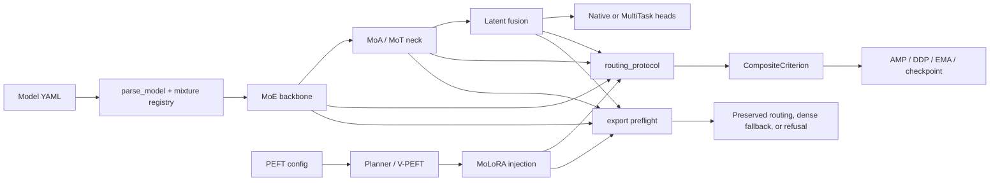

# YOLO-Master v26.08：增强版 Release 说明与审阅结论

> 本文是 `YOLO-Master-v26.08` 的独立增强说明，不替换 [`CHANGELOG.md`](../../CHANGELOG.md)。它把 v26.02 到 v26.08 的主要演进、当前能力边界、可复现证据和迁移影响集中在一处，便于 Release 审阅、下游集成和后续版本规划。

**Release tag:** `YOLO-Master-v26.08`<br>
**Tag target commit:** `43d40117c30811204fb9347efeabddce15f11a62`<br>
**Annotated tag object:** `8d876faea936b0c26aeca09a5fbe668c8d0bf918`<br>
**Underlying package:** `ultralytics==8.4.101`<br>
**Previous release:** [`YOLO-Master-v26.02`](https://github.com/Tencent/YOLO-Master/releases/tag/YOLO-Master-v26.02)<br>
**GitHub Release:** [YOLO-Master-v26.08](https://github.com/Tencent/YOLO-Master/releases/tag/YOLO-Master-v26.08)

## 1. Executive verdict

v26.08 is a framework transition rather than a feature-count release. v26.02 established ES-MoE, standard LoRA, Sparse SAHI, CW-NMS, MoE auxiliary loss, and pruning on the Ultralytics `8.3.240` generation. v26.08 rebases the project on Ultralytics `8.4.101` / YOLO26 and adds a common routing protocol, routed attention and transformer profiles, routed PEFT, latent routing, scoped MultiTask training, export governance, and P0-P2 lifecycle hardening.

The release is suitable for:

- native YOLO26 workflows that need the `8.4.101` parser, task, checkpoint, and export baseline;
- focused experiments with MoE, MoA, MoT, Latent Mixture, MoLoRA, or V-PEFT;
- the documented COCO-aligned detect/segment/pose MultiTask training and validation profile;
- component-level export, Agent, and cross-platform integration work where the target backend is separately validated.

It is not evidence for universal production performance. The repository does not record a full-dataset accuracy table for every routed profile, a real two-GPU NCCL training run, a multi-epoch CUDA/MPS AMP run, or routed TensorRT hardware latency.

## 2. Release scope and provenance

### 2.1 Audited source range

The direct Git range `YOLO-Master-v26.02..YOLO-Master-v26.08` contains:

| Measure | Value |
|---|---:|
| Total commits | 635 |
| Non-merge commits | 515 |
| Merge commits | 120 |
| Files changed | 3,353 |
| Insertions | 981,934 |
| Deletions | 23,747 |

These values are reproducible with:

```bash
git rev-list --count YOLO-Master-v26.02..YOLO-Master-v26.08
git rev-list --count --no-merges YOLO-Master-v26.02..YOLO-Master-v26.08
git rev-list --count --merges YOLO-Master-v26.02..YOLO-Master-v26.08
git diff --shortstat YOLO-Master-v26.02..YOLO-Master-v26.08
```

The counts intentionally avoid author aliases and pull-request identity heuristics. They therefore supersede older `622 commits / 96 PRs` summaries when an auditable Git range is required.

### 2.2 Published assets

The Release ships the underlying Python package version, not a separate `26.08` PyPI version:

| Asset | Size | SHA-256 |
|---|---:|---|
| `ultralytics-8.4.101-py3-none-any.whl` | 2,366,445 bytes | `17c038bbecf6fa64c9b89e6b1561d2501a89429d3002d75ec670e9b373df5496` |
| `ultralytics-8.4.101.tar.gz` | 1,825,585 bytes | `00afe91638debb597b52473f4b5647dc0c02563a0685b33212ade1412f3ea928` |

Verify an independently downloaded asset with:

```bash
shasum -a 256 ultralytics-8.4.101-py3-none-any.whl ultralytics-8.4.101.tar.gz
python -m pip install twine
twine check ultralytics-8.4.101-py3-none-any.whl ultralytics-8.4.101.tar.gz
```

## 3. What changed since v26.02

| Surface | v26.02 baseline | v26.08 position | Adoption status |
|---|---|---|---|
| Upstream foundation | Ultralytics `8.3.240` and early YOLO-Master variants | Ultralytics `8.4.101` / YOLO26 native task, checkpoint, parser, and export contracts | Stable upstream base |
| Conditional computation | ES-MoE routing, balancing loss, pruning | Shared routing protocol across MoE, MoA, MoT, Latent Mixture, and MoLoRA; auxiliary-loss de-duplication, EMA normalization, budget, diagnostics, and export declarations | Validated contracts; profiles remain scoped |
| Attention and transformer routing | Not part of the public v26.02 baseline | MoA local/regional/global attention and MoT transformer experts with temperature scheduling and sparse/eager boundaries | Experimental profiles |
| Parameter-efficient adaptation | Configuration-driven fixed-rank LoRA | Standard LoRA plus FewShot-LoRA, Planner/V-PEFT placement, LOVO validation, and routing-aware MoLoRA merge/save/load | Standard LoRA stable; extensions opt-in |
| Task coverage | Detection-centered release | Native YOLO26 task family retained; MultiTask detect/segment/pose training and validation with partial-label masks and resumable sampling | MultiTask preview |
| Deployment | Sparse SAHI and CW-NMS inference extensions | Export preflight, backend capability matrix, dense fallback declarations, and Windows/Linux/Jetson/macOS integration examples | Backend-specific |
| Reliability | Feature-level tests and scripts | AMP-safe sparse accumulation, MPS-safe paths, DDP/EMA/checkpoint lifecycle, non-finite recovery, governance manifests, and Agent contract checks | Release gate |

## 4. Evolution timeline

| Period | Major work | Release consequence |
|---|---|---|
| February 2026 | ES-MoE, standard LoRA, Sparse SAHI, CW-NMS, MoE loss, and pruning became the public baseline. | Existing detection and fixed-rank adaptation workflows remain available. |
| May–June | FewShot-LoRA controls, MoE loss/routing corrections, MoA blocks, MoT blocks, configurations, and ablation tests were added. | Conditional computation expanded from convolutional experts to attention and transformer paths. |
| Early July | MoLoRA, LOVO/scaling-law tooling, V-PEFT Planner integration, model-profile expansion, and C++ edge examples landed. | PEFT became a separate architecture-aware control plane. |
| Mid–late July | AMP/DDP/EMA/checkpoint hardening, NaN recovery, export preflight, capability reporting, governance checks, and the `8.4.101` rebase were completed. | Routed behavior received explicit numerical, distributed, checkpoint, and export contracts. |
| Early August | Shared Expert MoE, Latent Mixture contracts, MultiTask trainer/loss/data integration, and portable COCO smoke profiles were completed. | The release provides model-scoped expert reuse and a scoped detect/segment/pose MultiTask path. |

Representative traceability commits include `47a503e` (Ultralytics `8.4.101`), `752900f` (MoLoRA), `18527df` (MoA/MoT), `917fddc` and `fe3c087` (LOVO/V-PEFT integration), `aed6505` and `0d32bd1` (export governance), `82b6ad5` (Shared Expert MoE), and `31f48ea`, `a7684bd`, `aa5b891`, `a91ec77` (MultiTask).

## 5. Architecture and contract boundaries



The following boundaries are part of the release contract:

1. **Routing is not task selection.** MoT provides shared visual representation. `TaskRouter` gates task/shared features for YAML-enabled branches; the model and dataset contracts decide which branches are built and supervised.
2. **Latent Mixture defaults to `router_only`.** Auxiliary inputs affect routing probabilities but are not automatically used as expert values. `weighted_sum` is required for explicit value fusion.
3. **Eager sparse execution is not exported sparse execution.** ONNX-style tracing uses a declared dense fallback unless a backend advertises preserved routing. Dense fallback changes compute semantics and must be benchmarked separately.
4. **PEFT placement is separate from forward routing.** Planner/V-PEFT produces a placement decision; MoLoRA injects adapter experts without changing the YAML topology. Standard LoRA and enabled MoLoRA are mutually exclusive.
5. **MultiTask release scope is detect/segment/pose.** classify, depth, normal, and semantic criteria exist, but their validation metrics are incomplete; OBB MultiTask training is explicitly rejected until its data, assigner, angle loss, and validator path is complete.

## 6. Capability maturity matrix

| Component | Build/forward | Serialization | Export | End-to-end evidence | Release label |
|---|---|---|---|---|---|
| Native YOLO26 | Yes | Upstream baseline | Native paths | Deterministic finite-forward baseline | Stable upstream base |
| ES-MoE / gated MoE | Focused | Checkpoint and pruning contracts | Capability-gated | No universal accuracy/latency claim | Experimental / validated component |
| Shared Expert MoE | Yes | Model-scoped reuse and isolation | Component-level | No full deployment benchmark | Validated component |
| MoA | Yes | State and boundary tests | Dense fallback unless preserved | Detect-focused composition only | Experimental |
| MoT | Yes | Routing/DDP contracts | Dense fallback unless preserved | Detect and scoped MultiTask integration | Experimental |
| Latent Mixture | Yes | Named config and provenance | Calibration/preflight gates | No real multi-GPU or accuracy study | Experimental |
| Standard LoRA | Yes | Existing adapter flow | Existing PEFT boundary | Existing documented calls | Stable opt-in |
| MoLoRA / V-PEFT | Yes | Round-trip and merge contracts | Backend-dependent | No release-level accuracy table | Opt-in |
| MultiTask | Detect/segment/pose | Resumable sampler/checkpoint state | Prediction API remains limited | Focused training/validation | Preview |

## 7. P0-P2 closure and residual risks

### Closed or substantially hardened

- **P0 routing protocol:** canonical `routing_protocol.py` is the shared source of truth; the MoE facade re-exports compatibility symbols; auxiliary collection de-duplicates parent/child modules and isolates stale or non-finite entries.
- **P0 MultiTask contracts:** missing supervision is validity-masked, unsupported OBB training fails fast, and the shipped detect/segment/pose path has independent loss and validation outputs.
- **P1 data and resume:** `MultiTaskBatchSampler` supports weighted or round-robin sampling, DDP rank interleaving, and serializable state for deterministic resume.
- **P1 numerical paths:** sparse `index_add_` operations align dtypes for AMP, MPS uses safe sampling paths, and non-finite recovery synchronizes across ranks.
- **P1 export:** preflight checks module/backend declarations and records sparse/dense strategy, fallback, and performance caveats before export.
- **P2 PEFT observability:** MoLoRA fallback adapters round-trip through save/load and routing snapshots expose stable diagnostics.

### Residual risks that remain documented

| Risk | Current boundary | Required next evidence |
|---|---|---|
| Latent production readiness | Research-grade runnable profile; default `router_only`; no real multi-GPU/resume/export parity study | Fixed-seed accuracy study, 2-GPU AMP/DDP resume, ONNX/TensorRT numerical parity |
| Export cost | Dense fallback can approach all-expert FLOPs | Independent eager-sparse, eager-dense, and exported latency/FLOPs/memory benchmarks |
| MultiTask coverage | Detect/segment/pose validation only; OBB rejected | OBB data/assigner/angle loss/validator and metrics for additional tasks |
| Task weighting | Sampler weights and static loss weights are separate control surfaces | One YAML/CLI task-weight contract persisted in checkpoints |
| Data completeness | Unified COCO path requires polygon instances; partial dense supervision is masked | Bbox-only partial-label source and broader keypoint shape support |
| MoE maintenance | Multiple legacy re-export shims remain for checkpoint compatibility | Canonical/facade/deprecated inventory and key migration map |
| Observability | Rank-local and global routing metrics are available but task×expert gradients are incomplete | Unified usage, entropy, overflow, gradient coverage, and task affinity dashboard |

## 8. Validation evidence

The counts below describe different test scopes and must not be added together:

| Scope | Result | What it proves |
|---|---:|---|
| Release-freeze mixture/P0-P2 gate | **201 passed, 1 xfailed** | Focused promoted contracts and regression gate |
| Extended audit groups | **329 passed, 1 xfailed** | Five independently rerun protocol, latent, MultiTask, MoT, and PEFT groups |
| MultiTask group | **80 passed, 1 xfailed** | Sampler, partial-label masks, head/loss lifecycle, validator, and YAML integration |
| Agent Skill quick suite | **36/36 passed** | Skill dispatcher and contract checks |
| Package validation | `python -m build` and `twine check` passed | Wheel/sdist are structurally valid |
| Documentation validation | `codespell`, `git diff --check`, and `mkdocs build` passed | Release documentation is clean; existing site nav warnings remain unrelated |

Run the promoted focused gate:

```bash
pytest -q \
  tests/test_routed_module_protocol.py tests/test_routing_diagnostics.py \
  tests/test_molora_merge_semantics.py tests/test_p2_fixes.py \
  tests/test_latent_mixture.py tests/test_mixture_loss_composition.py \
  tests/test_mixture_model_registry.py tests/test_export_capability_matrix.py \
  tests/test_multitask.py tests/test_mot.py tests/test_mixture_export.py \
  tests/test_routing_aux_contract.py tests/test_mixture_aux_loss.py \
  tests/test_moe_router_boundaries.py tests/test_molora_vpeft_integration.py \
  tests/test_vpeft.py
python agent/scripts/validate_yolo_master_skill.py --suite quick --pretty --summary-only
```

The test evidence is fast unit, integration, serialization, and contract coverage. It does not establish full-dataset convergence, production throughput, multi-node NCCL stability, or universal backend compatibility.

## 9. Migration checklist

1. Install and verify the package identity:

   ```bash
   pip install -e .
   python -c "import ultralytics; print(ultralytics.__version__, ultralytics.__file__)"
   yolo version
   yolo checks
   ```

2. Keep official `ultralytics/cfg/models/26/yolo26*.yaml` files unchanged when the native YOLO26 baseline is required; select mixture profiles through additive YAML files.
3. Retest integrations that import Ultralytics internals directly against the `8.4.101` parser, trainer, task-head, checkpoint, and exporter contracts.
4. Keep standard LoRA calls unchanged. Enable MoLoRA only with `molora_num_experts > 0`; do not combine it with a positive standard `lora_r`.
5. Use `task="multitask"` only with a dataset that declares non-empty `tasks`, includes `detect`, and follows the supported COCO unified contract. The shipped release profile is detect/segment/pose.
6. Run export preflight for every routed backend and record whether the result is preserved routing, dense fallback, or refusal.

## 10. Release conclusion

The evidence supports describing v26.08 as a governed, extensible YOLO26 mixture framework with validated routing contracts and a scoped MultiTask preview. It does not support describing every routed profile as production-optimized or universally deployable. The highest-value next stage is evidence closure—real DDP/AMP resume, three-form export benchmarks, task-weight unification, OBB completion, and unified routing observability—rather than adding more unverified routing variants.

## References

- [Canonical `CHANGELOG.md`](../../CHANGELOG.md)
- [Canonical release notes](v26.08.md)
- [English release notes](../en/release-notes/v26.08.md)
- [Deep mixture audit](../../reports/yolo_master_mixture_audit_v2_verified_20260808.md)
- [Upstream `8.4.101` manifest](../governance/upstream-v8.4.101-manifest.json)
- [Native YOLO26 migration baseline](../../reports/migration/v8.4.101-native-baseline.json)
- [Source comparison: v26.02 → v26.08](https://github.com/Tencent/YOLO-Master/compare/YOLO-Master-v26.02...YOLO-Master-v26.08)
