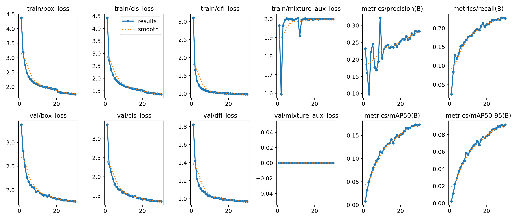
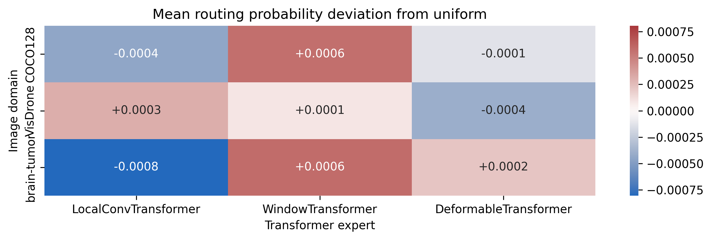
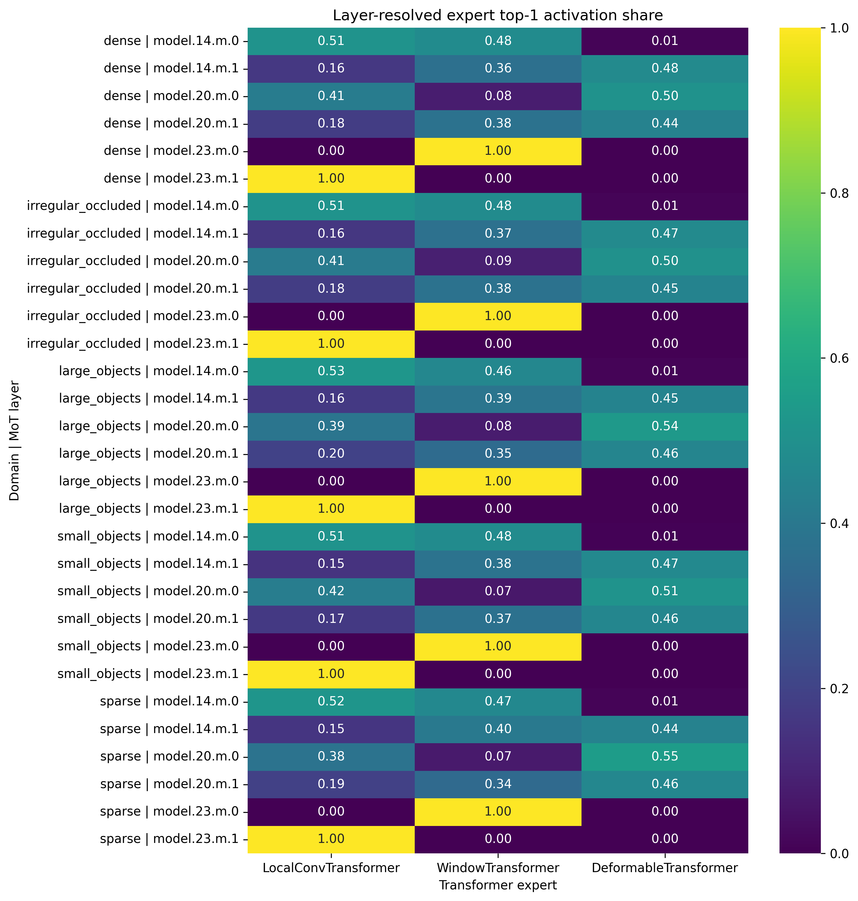

# Issue #54 正式实验结果

本页汇总 YOLO-Master-EsMoE-N、MoT-N、MoA-N 和新增 MoT-P5-N 的统一消融，以及固定
MoT checkpoint 的跨域路由审计。这里报告的是同一预算下的受控实验，不是充分收敛后的 SOTA
复现；所有数值均来自本目录中的原始 CSV，未运行的结论不作推断。

完整的问题发现、设计修正和复验过程见
[`../experiment_journey_zh.md`](../experiment_journey_zh.md)。

## 1. 实验协议

- 数据：VisDrone，6,471 张训练图、548 张验证图；
- 训练：从 YAML 初始化，30 epoch，`imgsz=640`，batch 16，seed 42，FP32；
- 设备：4 张 RTX 5090 各训练一个变体；
- 测速：同一张 RTX 5090，batch 1，50 次 warmup、200 次计时；
- 路由：同一个 `v10_mot/best.pt`，每个域或场景固定抽样 128 张图；
- 统计：5,000 次 bootstrap、5,000 次双侧 permutation test、BH-FDR；
- 路由 checkpoint SHA-256：
  `a1857c81b7aebd0efb5a56f9d5b37405ef83edcc68890add15c9c480e9fee629`。

公开复现元数据见 [`reproducibility.json`](reproducibility.json)，模型身份和原始指标见
[`model_comparison.csv`](model_comparison.csv)。

## 2. 消融结果

| 模型 | mAP50-95 | mAP50 | P50 / P95 / P99 (ms) | 实际 FLOPs (G) | Params (M) | 训练时间 |
|---|---:|---:|---:|---:|---:|---:|
| EsMoE-N | 0.09014 | 0.17446 | 18.563 / 18.671 / 18.959 | 8.505 | 3.420 | 0.945 h |
| MoT-N | 0.08912 | 0.16984 | 47.467 / 47.714 / 51.414 | 12.503 | 4.025 | 1.381 h |
| MoA-N | 0.08710 | 0.16837 | 40.650 / 40.870 / 43.381 | 9.102 | 3.546 | 1.274 h |
| **MoT-P5-N** | **0.09164** | **0.17309** | **19.628 / 19.707 / 20.539** | **8.632** | **3.494** | **1.066 h** |

四组最佳观测值均出现在第 30 轮；训练指标均为有限值，未出现 NaN、发散或恢复事件。训练曲线和
逐 epoch CSV 位于 [`training/`](training/)。

### 2.1 混合架构判定

MoT-P5 相对完整 MoT：

- mAP50-95 增加 0.252 个百分点；
- P50/P95/P99 分别降低 58.65%/58.70%/60.05%；
- 实际 FLOPs 降低 30.96%，参数量降低 13.20%。

这说明把 MoT 限制在低分辨率 P5 是完整 MoT 的有效低预算替代方案。但相对 EsMoE 基线，
MoT-P5 的 mAP50-95 只增加 0.150 个百分点，P50 反而增加 5.74%。Issue 中“mAP 提升 > 1%”
存在口径歧义：按绝对百分点没有达到，按相对比例则提升 1.66%。在维护者确认口径前，本报告采用
更保守的绝对百分点解释，不声称“MoE + MoT 已产生协同增益”。

其余三组的同格式曲线和逐 epoch CSV 也保存在 [`training/`](training/)。

## 3. 路由复验

### 3.1 VisDrone 密集与稀疏场景

`dense` 与 `sparse` 没有共享图像，推断检验有效。由 dense 到 sparse：

| 专家/指标 | 差值 | bootstrap 95% CI | Hedges' g | FDR q |
|---|---:|---:|---:|---:|
| Local mean probability | -0.000719 | [-0.000840, -0.000599] | -1.470 | 0.00105 |
| Window mean probability | +0.000129 | [+0.000023, +0.000231] | +0.292 | 0.04304 |
| Deformable mean probability | +0.000590 | [+0.000451, +0.000734] | +1.018 | 0.00105 |
| Deformable top-1 share | +0.004937 | [+0.000521, +0.009321] | +0.266 | 0.04684 |

方向上，稀疏场景把少量概率从 Local 路由到 Deformable；但最大概率差仅 0.000719，实际幅度很小，
不能仅凭显著性宣称形成了强专家分工。

### 3.2 VisDrone 大目标与小目标

`large_objects` 与 `small_objects` 也没有共享图像。由 large 到 small，Window top-1 share
增加 0.004537，95% CI `[0.000850, 0.008337]`，`q=0.03474`；Local top-1 share 减少
0.004884，95% CI `[-0.007986, -0.001846]`，`q=0.00600`。三类专家的 mean probability
差异均未通过 FDR，因此这里只能描述为弱 top-1 排序变化。

### 3.3 遮挡代理假设未被验证

初版把 `dense` 与 `irregular_occluded` 当作独立场景比较。样本指纹复查发现两组共享
104/128 张图，独立样本 permutation test 的前提不成立。修复后这些行标记为
`comparison_valid=false`，CI、p-value 和 q-value 均不再生成。

因此本实验不能证明 DeformableTransformer 在遮挡/不规则目标中显著增加。下一轮需要构建互斥且
按密度、尺度匹配的遮挡数据，或使用配对统计模型。

### 3.4 医疗域外输入

同一 VisDrone checkpoint 从 VisDrone 切换到 brain-tumor 后，Deformable top-1 share 增加
0.009824，mean probability 增加 0.000620（95% CI `[0.000467, 0.000774]`，
`q=0.00035`）。这是可重复的域外路由变化，但绝对概率变化仍很小，且模型没有在 brain-tumor
上训练或验证，不能外推为医疗检测性能或临床价值。

## 4. 第二次复验发现的新问题

分层热力图显示，`model.23.m.0` 的 Window top-1 share 为 1，`model.23.m.1` 的 Local top-1
share 为 1，但两层三专家概率都接近 1/3、归一化熵为 1。这不是清晰的专家专业化，而是近均匀
概率下微小数值差异决定 argmax。

代码与梯度探针进一步定位到 `top_k=1`：唯一入选权重重归一化后恒为 1，router 的主任务梯度很弱。
随机输入探针得到的 router 梯度范数和为：

| 配置 | 梯度范数和 |
|---|---:|
| top-k=1, exploration=0 | 8.9e-9 |
| top-k=1, exploration=0.02 | 1.53e-4 |
| top-k=2, exploration=0.02 | 9.90e-3 |

这解释了深层路由弱分化，但不能证明修改 `top_k` 会提升检测。正确的下一步是重训
`top_k / exploration_eps / straight-through` 消融，而不是在当前 checkpoint 上直接改行为。

## 5. 场景化建议

1. **资源受限但希望保留 MoT 时选 MoT-P5。** 相比完整 MoT，P50 降低 58.65%、FLOPs
   降低 30.96%，同时 mAP50-95 增加 0.252 个百分点；它尚不能替代 EsMoE 作为速度基线。
2. **稀疏航拍场景只能视为弱 Deformable 偏好。** Deformable mean probability 增加
   0.000590、top-1 share 增加 0.004937，统计稳定但实际幅度小。
3. **小目标场景出现弱 Window argmax 偏移。** Window top-1 share 增加 0.004537，但
   mean probability 未显著变化，不应写成“Window 专家显著主导小目标”。
4. **遮挡结论暂缓。** 当前代理组与 dense 重叠 81.25%，只能报告描述统计，不能支持原假设。
5. **医疗图像只用于 OOD 审计。** brain-tumor 的 Deformable top-1 增加 0.982 个百分点，
   不能替代医疗数据微调、检测评估或临床验证。

## 6. 稳健性与限制

水平翻转及亮度扰动下，主导专家一致率为 96.74% 至 99.87%，平均 JSD 不超过
`5.30e-7`。路由对这些扰动稳定，但该结果部分来自整体概率接近均匀，不能单独当作路由质量证据。

主要限制：

- 30 epoch 受控预算不足以代表充分收敛上限；
- 单 seed、单硬件测速不能外推到 TensorRT、ncnn 或其他 GPU；
- CUDA attention/pooling 存在 warn-only 非确定性算子，不声称跨硬件 bitwise 一致；
- 路由激活与检测精度尚无因果证据；
- 公开结果包不包含模型权重、原始数据或本地绝对路径。

## 7. 证据索引

| 内容 | 文件 |
|---|---|
| 四模型汇总与 checkpoint 哈希 | [`model_comparison.csv`](model_comparison.csv) |
| 环境、协议与抽样设置 | [`reproducibility.json`](reproducibility.json) |
| 跨域聚合、检验与扰动 | [`cross_domain/`](cross_domain/) |
| VisDrone 场景聚合、检验与重叠审计 | [`visdrone_scenes/`](visdrone_scenes/) |
| 四模型逐 epoch 指标与曲线 | [`training/`](training/) |
