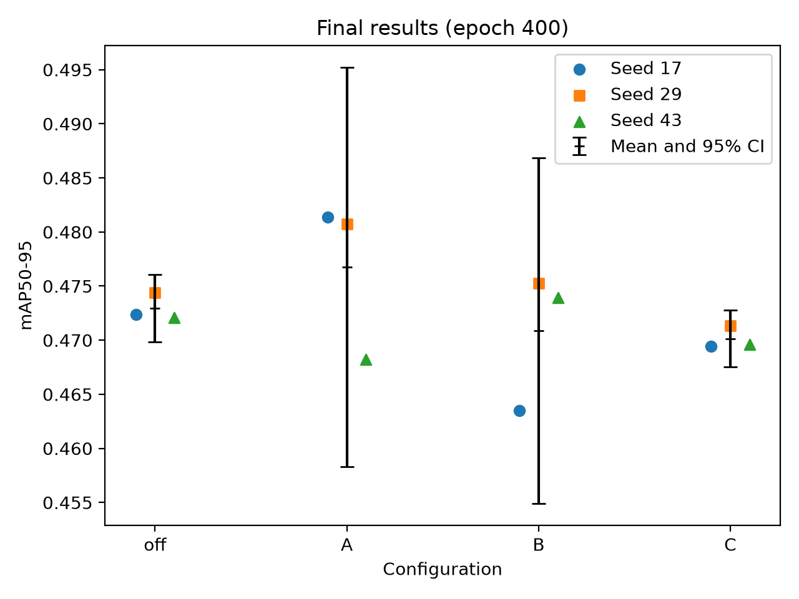
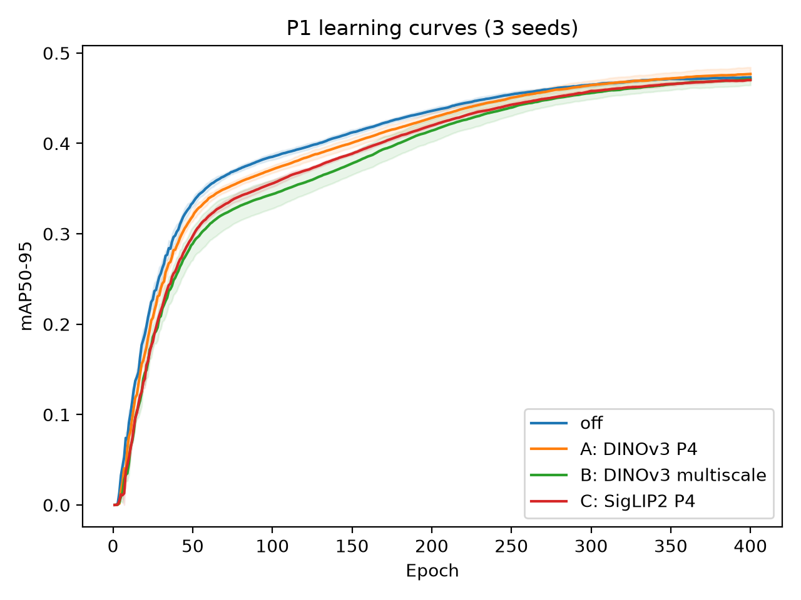
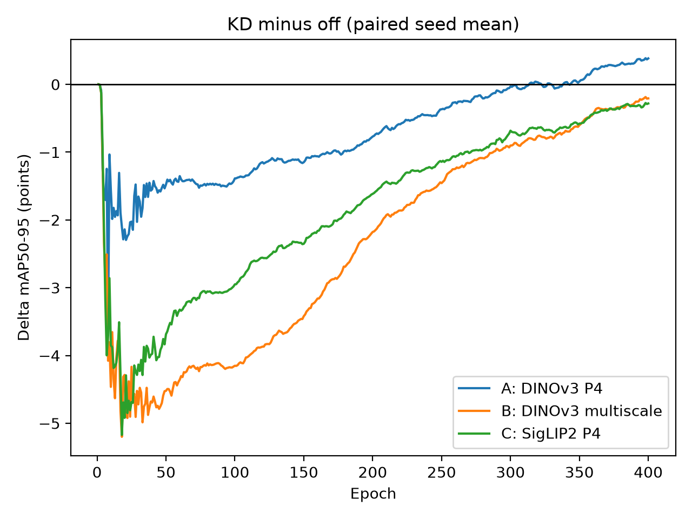

# D2 P1 实验总结：Foundation 特征蒸馏对 YOLO-Master 的影响

## 结论摘要

P1 完成了同预算 KD-off 对照，以及计划矩阵中的 A、B、C 三种蒸馏配方。每格和 off 均完成 `17`、`29`、`43` 三个随机种子，共 12 次 400-epoch VOC 训练。D 格按“2×2 中至少完成 3 格”的验收要求跳过。

当前结果没有证明 Foundation 特征蒸馏能够稳定提升精度：

- A（DINOv3 + P4）相对同 seed baseline 平均 `+0.383 mAP`，超过预设的 `0.3 mAP` 实用阈值，但三个 seed 中两个提升、一个下降，95% CI 跨 0。因此 A 只能作为方向性信号，不能宣称稳定涨点。
- B（DINOv3 + multiscale）平均 `-0.207 mAP`，绝对差值小于 `0.3 mAP` 且 95% CI 包含 0，按预设规则判为 no-go。
- C（SigLIP2 + P4）三个 seed 均小幅下降，平均 `-0.282 mAP`。配对 CI 不含 0，说明这批运行中的下降较一致；其幅度接近但小于实用阈值，当前没有继续投入的正向证据。
- 所有 KD 配置在训练前中期总体落后于 off。只有 A 的三 seed 平均曲线在训练后期反超；B、C 到 epoch 400 仍低于 off。

## P1 验收范围

| 实验格 | 教师 | 蒸馏位置 | 完成情况 |
|---|---|---|---|
| off | 无 | 无 | 3 seeds 完成 |
| A | DINOv3 | P4 | 3 seeds 完成 |
| B | DINOv3 | P3+P4+P5 | 3 seeds 完成 |
| C | SigLIP2 | P4 | 3 seeds 完成 |
| D | SigLIP2 | P3+P4+P5 | 按验收要求跳过 |

A/B/C 使用不同的固定 KD 权重，因此它们是完整配方比较。A/B 的差异不能只归因于蒸馏尺度，A/C 的差异也不能只归因于教师。D 未运行，因此不能估计完整交互。

## 实验可信度与证据

重新归档后的 12 个 `resolved_args.yaml` 通过事后无混杂核查。同一实验格的三个 seed 使用相同的 teacher、蒸馏层级和 `foundation_loss_weight`；共享训练预算保持一致。每个 treatment 均与相同 seed 的 off 配对。

证据位置：

- 汇总表：`experiments/d2/results/p1voc_summary.md`
- 原始逐 epoch 指标：`experiments/d2/results/p1voc_<arm>-s<seed>/metrics.csv`
- 实际解析参数：`experiments/d2/results/p1voc_<arm>-s<seed>/resolved_args.yaml`

## 最终精度

下表为 epoch 400 的 `metrics/mAP50-95(B)`。数值使用 0–1 标度；例如 `0.00383` 等于 `0.383 mAP` 点。

| 实验格 | seed 17 | seed 29 | seed 43 | 均值 | 标准差 |
|---|---:|---:|---:|---:|---:|
| off | 0.47239 | 0.47440 | 0.47207 | 0.47295 | 0.00126 |
| A：DINOv3 P4 | 0.48138 | 0.48075 | 0.46821 | **0.47678** | 0.00743 |
| B：DINOv3 multiscale | 0.46349 | 0.47524 | 0.47392 | 0.47088 | 0.00644 |
| C：SigLIP2 P4 | 0.46943 | 0.47135 | 0.46962 | 0.47013 | 0.00106 |

## 与 baseline 的配对效应

每个 treatment 减去相同 seed 的 off。95% CI 使用三个配对差值计算的双侧 t 区间；`n=3` 使 A/B 的区间很宽，统计不确定性较大。

| 对照 | 各 seed 的 ΔmAP50-95 | 平均 Δ（0–1） | 平均 Δ（mAP 点） | 95% CI（0–1） |
|---|---|---:|---:|---|
| A - off | +0.00899, +0.00635, -0.00386 | +0.00383 | **+0.383** | [-0.01303, +0.02069] |
| B - off | -0.00890, +0.00084, +0.00185 | -0.00207 | -0.207 | [-0.01682, +0.01268] |
| C - off | -0.00296, -0.00305, -0.00245 | -0.00282 | -0.282 | [-0.00362, -0.00202] |



*图 1：epoch 400 的三个 seed 原始结果；黑色标记和误差线为各组绝对 mAP 均值及双侧 t 分布 95% CI。go/no-go 使用上表的配对差值和区间判断。*

预设规则为：

```text
|ΔmAP| < 0.3 mAP 点，并且 95% CI 包含 0 => no-go
```

## 配方间探索性比较

| 比较 | 回答的问题 | 平均差值 | 95% CI | 解释 |
|---|---|---:|---|---|
| A - C | DINOv3 P4 配方是否优于 SigLIP2 P4 配方 | +0.00665 | [-0.01097, +0.02427] | 平均值偏向 A，但 seed 43 方向相反，结论不确定 |
| A - B | DINOv3 P4 配方是否优于 DINOv3 multiscale 配方 | +0.00590 | [-0.02343, +0.03522] | 平均值偏向 A，但区间很宽，配方差异不确定 |

两组比较都没有得到稳定的配方优势。A 的均值最高，但其 seed 间方差也最大。由于 A/B/C 的固定 KD 权重不同，这些差值不能进一步拆成纯教师效应或纯尺度效应。

## 训练动态



*图 2：逐 epoch 的三 seed 平均 mAP，阴影为 ±1 样本标准差；未进行平滑。*



*图 3：先按相同 seed 计算 KD − off，再取三个 seed 的均值；单位为 mAP 点。*

图表可运行 `python experiments/d2/scripts/plot_p1_findings.py` 重新生成。

| Epoch | A - off | B - off | C - off |
|---:|---:|---:|---:|
| 50 | -0.0148 | -0.0452 | -0.0369 |
| 100 | -0.0139 | -0.0415 | -0.0295 |
| 200 | -0.0077 | -0.0218 | -0.0162 |
| 300 | -0.0003 | -0.0090 | -0.0068 |
| 325 | -0.0004 | -0.0079 | -0.0068 |
| 350 | +0.0004 | -0.0060 | -0.0058 |
| 375 | +0.0028 | -0.0036 | -0.0037 |
| 400 | **+0.0038** | **-0.0021** | **-0.0028** |

A 的三 seed 平均差值从 epoch 344 起保持为正直到训练结束，但 seed 43 的最终差值仍为负。因此该曲线说明平均收益出现在后期，并不表示每个 seed 都反超。B、C 没有持续至训练结束的平均反超。

## Go/No-go 建议

| 路线 | 判定 | 依据 |
|---|---|---|
| A：DINOv3 P4 | **方向性信号** | 平均提升超过实用阈值，但只有 2/3 seeds 为正且 CI 跨 0 |
| B：DINOv3 multiscale | **no-go** | 命中预设 no-go 规则 |
| C：SigLIP2 P4 | **停止** | 三个 seeds 均下降，没有正向证据 |
| D：SigLIP2 multiscale | **不运行** | 已满足三格验收要求 |

## 最终结论

P1 完成了预定实验矩阵和同预算对照，但没有得到 Foundation 特征蒸馏稳定涨点的证据。DINOv3 P4 的平均结果最好，并显示晚期方向性收益；由于一个 seed 为负且置信区间宽，只适合记录为待复现信号。DINOv3 multiscale 命中 no-go 条件，SigLIP2 P4 则表现为一致的小幅下降。现有证据支持保留完整配置、代码、逐轮指标和负结果，暂不作更强的精度主张。
