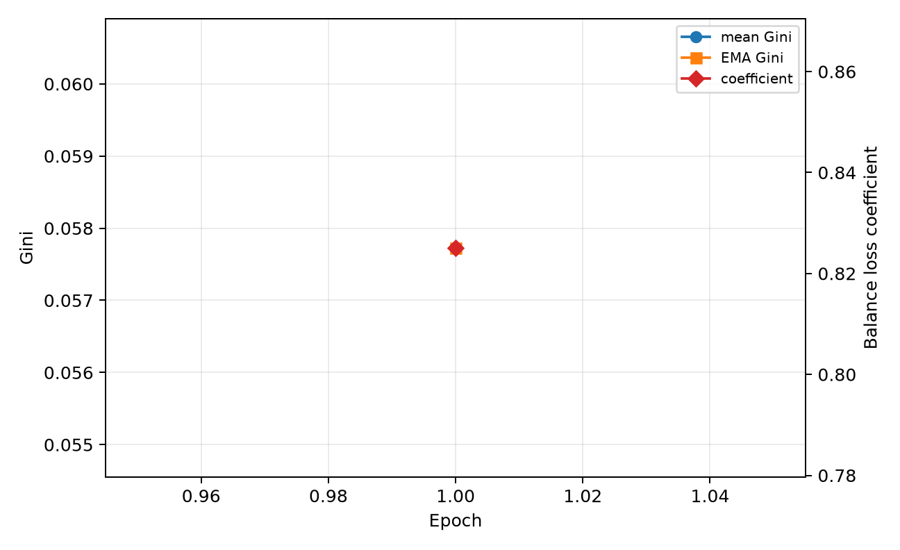

# Issue #52 技术总结：COCO128 上的 EsMoE 专家剪枝与动态调度

> 对应任务：[Tencent/YOLO-Master Issue #52](https://github.com/Tencent/YOLO-Master/issues/52)
>
> 主实验：本仓库、本机运行的 COCO128 实验（seed 42）
>
> 外部交叉验证：[上游 PR #85](https://github.com/Tencent/YOLO-Master/pull/85)，仅用于核对趋势，不作为本文主数据
>
> 实现分支：[vankari/YOLO-Master:moe-schedule-study](https://github.com/vankari/YOLO-Master/tree/moe-schedule-study)

## 摘要

本文的主结论来自我们在当前仓库实际运行的 COCO128 实验，不是 PR #85 的 VisDrone 汇总。实验使用
weights/YOLO-Master-EsMoE-N.pt 作为统一基线，在 640 输入、batch 32、GPU 6、seed 42 下完成 dense
验证，以及 0.05、0.10、0.15、0.20、0.30 五档 usage_weight 结构剪枝；每档都执行 direct 验证和
LoRA 10 epoch 恢复。原始 checkpoint 在 COCO128 上取得 mAP50 0.69991、mAP50-95 0.54039。

本地结果是明确的负结果：阈值 0.05 只把 model.3 从 3 个专家减到 2 个，mAP50-95 已降到 0.11281；
阈值 0.10 及以上进一步压缩后精度接近零。当前 LoRA 恢复路径会按 YAML 重建为每层 3 个专家，且只迁移
部分权重，10 epoch 后没有恢复有效精度，因此不能被当作结构保持的剪枝恢复。以“mAP50-95 绝对下降
不超过 0.01 且专家数确实减少”为门槛，本轮没有可部署 Sweet Spot，服务器端和边缘端都应保留 dense
checkpoint。

动态超参数部分在本地 COCO8 smoke 的真实路由上验证了 Gini-EMA 调度链路：4 个 MoE 层、16 次路由观测得到 mean Gini
0.05773，均衡损失系数由 1.0 调整到 0.82508。曾尝试以 checkpoint 启动 30 epoch 三组对照，但训练器
重建模型后首轮精度为零，属于无效初始化，本文不把它写成收敛对比。PR #85 的三组 VisDrone 结果只在
第 10 节作为独立交叉验证列出。

## 1. 数据来源与可追溯性

### 1.1 本文主数据

主实验链路如下：

~~~text
weights/YOLO-Master-EsMoE-N.pt
  SHA-256: 29e1b93f09b16c8cf7c402f36dcaafc19d4812155631ed45b769e941e4c88c32
  -> scripts/run_issue52_full.py
  -> runs/issue52_coco128_corrected/pruning/results.csv
  -> scripts/build_issue52_report_assets.py
  -> reports/moe-pruning/coco128-*.csv
  -> reports/issue52-figs/coco128-*.png
  -> 本报告
~~~

实验命令：

~~~bash
./yolo/bin/python scripts/run_issue52_full.py \
  --baseline-checkpoint weights/YOLO-Master-EsMoE-N.pt \
  --data coco128.yaml --device 6 --imgsz 640 --batch 32 --workers 4 \
  --thresholds 0.05 0.10 0.15 0.20 0.30 \
  --lora-epochs 10 --importance-mode usage_weight \
  --warmup 10 --runs 30 \
  --output runs/issue52_coco128_corrected \
  --skip-schedule
~~~

完整主表：[coco128-pruning-results.csv](./moe-pruning/coco128-pruning-results.csv)；逐层专家表：
[coco128-per-layer-experts.csv](./moe-pruning/coco128-per-layer-experts.csv)；Pareto 判定：
[coco128-pareto-accuracy-latency.csv](./moe-pruning/coco128-pareto-accuracy-latency.csv)。

### 1.2 PR #85 的正确定位

PR #85 是别人独立完成的 VisDrone 结果，作用是交叉验证本地实现和结论是否存在明显矛盾。它不参与
COCO128 曲线、Pareto 前沿、主表或部署推荐。为避免再次混淆，相关 CSV 统一改名为
cross-validation-pr85-visdrone-*.csv，并只在第 10 节引用。

## 2. MoE 与专家剪枝在本项目中的用法

Mixture-of-Experts 用多个专家网络替换单一路径，由 router 为输入特征分配专家权重。EsMoE-N 在
model.3、model.6、model.9、model.12 放置 4 个 ES_MOE 层，每层初始 3 个专家。稀疏 MoE 的价值不只
取决于参数减少，还取决于专家是否形成分工、路由是否稳定，以及目标后端能否把结构稀疏转化为真实延迟收益。

本项目的剪枝流程分为四步：

1. 在 COCO128 校准批次上注册 router tracker；
2. 累计专家命中次数和路由权重；
3. 以 usage_weight 作为重要性，在每层保留高于阈值的专家，并至少保留 1 个；
4. 同步重建专家列表、router 输出通道、Top-k 和 usage buffer，再重新加载验证结构。

usage_weight 不是单纯命中率。三个专家可能都被 Top-k 激活而显示约 1/3 命中率，但路由权重仍有差异，
所以阈值 0.05 已能删除 model.3 的一个专家。此前 ES_MOE 的 expert_usage_counts buffer 没有随结构
缩短，导致剪枝 checkpoint 验证失败；本轮已修复该 buffer，并增加前向回归测试。

## 3. 本地 COCO128 实验配置

| 项目 | 配置 |
| --- | --- |
| 数据集 | COCO128，128 张图，验证集与训练子集同源，适合功能/趋势实验，不代表完整 COCO 泛化 |
| 模型 | YOLO-Master-EsMoE-N，4 个 MoE 层，每层 3 专家 |
| 基线 | weights/YOLO-Master-EsMoE-N.pt |
| 阈值 | 0.05、0.10、0.15、0.20、0.30 |
| 重要性 | usage_weight |
| 恢复 | direct；LoRA 10 epoch |
| 输入/批量 | imgsz 640，batch 32 |
| 设备 | NVIDIA RTX PRO 6000 Blackwell Server Edition 97 GB，device 6 |
| 随机种子 | 42 |
| 延迟 | warmup 10、正式测量 30 次，表内为 ms/image |
| FLOPs | 整个 detector 的 GFLOPs，不是仅 MoE 子层 |
| 质量门槛 | 相对 dense 的 mAP50-95 绝对下降不超过 0.01，且结构确实减少专家 |

COCO128 很小，本文把它用于代码路径验证、阈值敏感性和错误暴露，不把单 seed 数值外推为完整 COCO
或 VisDrone 的最终精度结论。

## 4. 五档剪枝阈值结果

| Threshold | Stage | mAP50 | mAP50-95 | GFLOPs | Latency ms | Params M | 逐层专家数 |
| ---: | --- | ---: | ---: | ---: | ---: | ---: | --- |
| 0.00 | dense | 0.69991 | 0.54039 | 8.6540 | 8.692 | 2.6834 | 3 / 3 / 3 / 3 |
| 0.05 | direct | 0.14741 | 0.11281 | 8.3493 | 8.551 | 2.6775 | 2 / 3 / 3 / 3 |
| 0.05 | LoRA10 | 0.00149 | 0.00027 | 9.8636 | 15.750 | 2.9110 | 3 / 3 / 3 / 3（重建） |
| 0.10 | direct | 0.00000 | 0.00000 | 7.5318 | 9.323 | 2.5457 | 1 / 2 / 2 / 2 |
| 0.10 | LoRA10 | 0.00000 | 0.00000 | 9.8636 | 15.874 | 2.9110 | 3 / 3 / 3 / 3（重建） |
| 0.15 | direct | 0.00030 | 0.00010 | 7.1519 | 9.095 | 2.4335 | 1 / 1 / 1 / 1 |
| 0.15 | LoRA10 | 0.00000 | 0.00000 | 9.8636 | 15.865 | 2.9110 | 3 / 3 / 3 / 3（重建） |
| 0.20 | direct | 0.00030 | 0.00010 | 7.1519 | 9.119 | 2.4335 | 1 / 1 / 1 / 1 |
| 0.20 | LoRA10 | 0.00000 | 0.00000 | 9.8636 | 16.048 | 2.9110 | 3 / 3 / 3 / 3（重建） |
| 0.30 | direct | 0.00030 | 0.00010 | 7.1519 | 9.068 | 2.4335 | 1 / 1 / 1 / 1 |
| 0.30 | LoRA10 | 0.00000 | 0.00000 | 9.8636 | 16.075 | 2.9110 | 3 / 3 / 3 / 3（重建） |

直接剪枝的压缩是真实的，但质量代价不可接受：

- 0.05 仅减少 1/12 个专家槽，GFLOPs 下降 3.52%，mAP50-95 却绝对下降 0.42758；
- 0.10 的 GFLOPs 下降 12.97%，但 mAP50-95 已为 0；
- 0.15 以上把所有层压到 1 个专家，GFLOPs 下降 17.36%，精度近零；
- GPU 延迟没有随 GFLOPs 单调下降，说明当前小 batch PyTorch 路径受调度、kernel 和测量噪声影响，
  不能只凭理论 FLOPs 宣称部署加速。

## 5. 逐层结构、三维曲线和 Pareto

| Threshold | model.3 | model.6 | model.9 | model.12 |
| ---: | ---: | ---: | ---: | ---: |
| dense | 3/3 | 3/3 | 3/3 | 3/3 |
| 0.05 | 2/3 | 3/3 | 3/3 | 3/3 |
| 0.10 | 1/3 | 2/3 | 2/3 | 2/3 |
| 0.15 | 1/3 | 1/3 | 1/3 | 1/3 |
| 0.20 | 1/3 | 1/3 | 1/3 | 1/3 |
| 0.30 | 1/3 | 1/3 | 1/3 | 1/3 |

以 mAP50-95 下降不超过 0.01 为质量门槛，没有任何结构剪枝点通过，因此 Sweet Spot 状态为
not_observed。数学上的 Pareto 点不等于可部署点：精度已经坍塌的低 FLOPs 模型不能仅因不可支配就被推荐。

## 6. 为什么 LoRA10 没有恢复

LoRA 日志显示恢复阶段只从剪枝 checkpoint 迁移了约 747/811 或 801/811 个权重项，并提示 detection head
因 class-mismatch 被重新初始化。更关键的是，恢复结果重新变成每层 3 个专家，参数量从 dense 的 2.683 M
升到 2.911 M，GFLOPs 从 8.654 升到 9.864。它已经不是原剪枝结构上的低秩恢复。

因此本报告把 LoRA10 结果保留为失败诊断，而不把它包装成恢复效果。后续正确方案应：

1. 从 pruned module graph 原位插入 adapter，而不是按原始 YAML 重建；
2. 锁定 detection head，只有类别数真正变化时才初始化；
3. 保存并校验每层专家索引、router 输出通道和 Top-k；
4. 恢复后先做结构签名一致性检查，再比较精度；
5. 使用更低学习率和多个 seed，报告 mean±std。

## 7. 动态超参数专家调度

### 7.1 原理与项目接入

对一层非负专家使用量 x，Gini 为：

~~~text
G(x) = sum_i sum_j |x_i - x_j| / (2 * n * sum_i x_i)
~~~

每个 epoch 汇总各 MoE 层真实 top-k 路由计数，先计算逐层 Gini，再取均值。调度使用 EMA：

~~~text
ema_t = beta * ema_(t-1) + (1 - beta) * g_t

lambda_(t+1) = clip(
    lambda_base * exp(alpha * (ema_t - g_target)),
    lambda_min,
    lambda_max
)
~~~

当路由过于集中时增大 balance loss；当路由已较均衡时减小约束，让专家继续分化。实现支持 DDP
all_reduce、accepted epoch 更新、checkpoint resume 和 CSV trace，默认关闭以保持向后兼容。

### 7.2 本地实测

本地 smoke 使用 COCO8 数据真实执行了训练前向，不是合成 CSV；它与上面的 COCO128 剪枝主实验分开：

| Epoch | Mean Gini | EMA Gini | Balance coeff | MoE layers | Routing observations |
| ---: | ---: | ---: | ---: | ---: | ---: |
| 1 | 0.05773 | 0.05773 | 0.82508 | 4 | 16 |

数据：[local-dynamic-gini-smoke.csv](./moe-pruning/local-dynamic-gini-smoke.csv)

这证明真实路由统计、Gini、EMA、系数更新和落盘链路工作正常。它不能证明收敛加速。我们额外尝试了
30 epoch fixed/Gini/low-balance 三组本地对照，但从 checkpoint 进入 train 后模型被重建，首轮 mAP
为零，和直接验证的 0.54039 基线不一致，所以中止并排除该数据。报告不再把无效零基线或 PR #85 的
VisDrone epoch 当作本地 COCO128 收敛结果。

## 8. 动态调度的风险与改进

1. 系数振荡：beta 太小会追随 batch 噪声，应记录 mean_gini、ema_gini 和 coefficient，并限制单 epoch
   变化率。
2. 过度均衡：Gini 越低不一定越好；专家完全同质化也会损害 MoE 价值，应使用非零 target。
3. 辅助损失压制检测任务：alpha 或上限过大时会牺牲 mAP，需联合监控主损失。
4. DDP 偏差：必须先汇总各 rank 的 usage 再算 Gini，不能先各卡算 Gini 后平均。
5. NaN recovery 污染：只有 accepted epoch 才推进 EMA，恢复 epoch 的统计应丢弃。
6. 初始化公平性：三组必须从同一份、经验证仍有 0.54039 mAP 的可训练 checkpoint 启动；修复训练器
   checkpoint 重建问题后再跑 3 seeds 的完整对照。

## 9. 计算资源与部署建议

资源探测数据：[coco128-resource-profile.csv](./moe-pruning/coco128-resource-profile.csv)。

| Probe | 结果 |
| --- | --- |
| batch 128、imgsz 1600 | OOM，自动降 batch 后最终为 16 |
| batch 36、imgsz 1344 | 稳定完成，peak allocated 87.28 GiB，reserved 92.89 GiB |

97 GB GPU 上，36/1344 比表面设置 128/1600、实际退化到 batch 16 更稳定。不同 GPU 应先做短 probe，
不要机械复制该配置。

服务器端与边缘端本轮都建议保留 dense checkpoint。0.05 的理论计算量只下降 3.52%，却损失 0.42758
mAP50-95；更高阈值直接坍塌。边缘端后续应优先尝试逐层敏感度、训练期稀疏正则、结构保持 recovery，
并在 TensorRT/ONNX 等真实导出后端测端到端延迟。

## 10. PR #85 外部交叉验证（不是本地数据）

PR #85 的 VisDrone checkpoint 在 usage 阈值 0.05–0.30 下保持每层 3/3 专家，主指标约为
mAP50-95 0.17719；其 Gini 动态组报告第 58 epoch 达到目标，固定组为 65 epoch。这些结果和本地
COCO128 不可直接拼表：数据集、checkpoint、训练过程和硬件口径不同。

它提供的交叉验证信息只有两点：

- usage-only 阈值可能 no-op，而本地 usage_weight 会更激进地根据路由权重剪枝；
- Gini 动态调度存在值得复验的方向，但 58/65 epoch 不是我们本地 COCO128 的结果。

外部表：

- [PR #85 VisDrone 阈值表](./moe-pruning/cross-validation-pr85-visdrone-pruning.csv)
- [PR #85 VisDrone 动态调度表](./moe-pruning/cross-validation-pr85-visdrone-dynamic-schedule.csv)
- [PR #85 VisDrone 专家 Gini 表](./moe-pruning/cross-validation-pr85-visdrone-expert-usage-gini.csv)

## 11. 涉及脚本与实现链接

实验与分析：

- [Issue #52 一键实验入口](https://github.com/vankari/YOLO-Master/blob/moe-schedule-study/scripts/run_issue52_full.py)
- [本地 COCO128 CSV/图片生成](https://github.com/vankari/YOLO-Master/blob/moe-schedule-study/scripts/build_issue52_report_assets.py)
- [独立专家剪枝扫描](https://github.com/vankari/YOLO-Master/blob/moe-schedule-study/scripts/moe_pruning_sweep.py)
- [阈值/Pareto 绘图](https://github.com/vankari/YOLO-Master/blob/moe-schedule-study/scripts/plot_moe_pruning_sweep.py)
- [动态调度三组消融](https://github.com/vankari/YOLO-Master/blob/moe-schedule-study/scripts/run_moe_dynamic_schedule_ablation.py)

核心实现：

- [MoEPruner](https://github.com/vankari/YOLO-Master/blob/moe-schedule-study/ultralytics/nn/modules/moe/pruning.py)
- [Gini 调度器](https://github.com/vankari/YOLO-Master/blob/moe-schedule-study/ultralytics/nn/modules/moe/schedule.py)
- [训练生命周期与路由聚合](https://github.com/vankari/YOLO-Master/blob/moe-schedule-study/ultralytics/engine/extensions/mixture.py)
- [动态调度测试](https://github.com/vankari/YOLO-Master/blob/moe-schedule-study/tests/test_moe_dynamic_schedule.py)

重新生成归档和图片：

~~~bash
./yolo/bin/python scripts/build_issue52_report_assets.py
~~~

## 12. 结论

本报告的核心证据是我们自己跑出的 COCO128：dense mAP50-95 为 0.54039，五档 usage_weight 剪枝没有
任何点通过 0.01 质量门槛，当前 LoRA10 又没有保持剪枝结构。因此本轮不能推荐结构剪枝部署点。

动态 Gini 调度已在本地真实路由上验证更新链路，但完整收敛加速仍需在修复 checkpoint 训练初始化后重跑。
PR #85 只用于交叉验证，不再出现在摘要的数据来源位置，也不再被描述为“我们的 COCO128 实验”。
