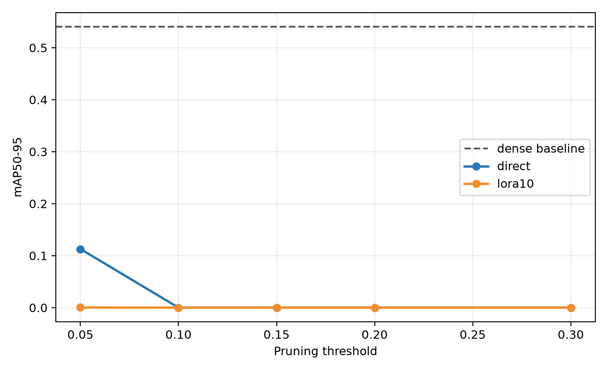
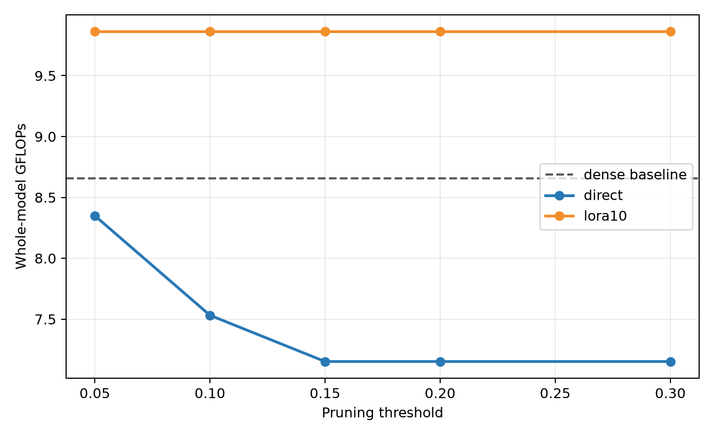
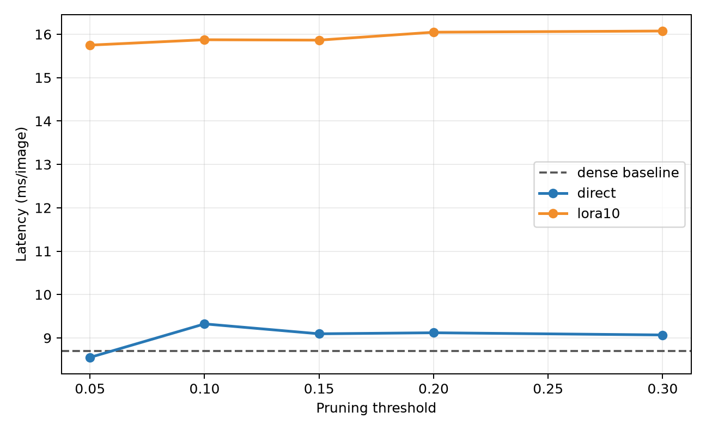
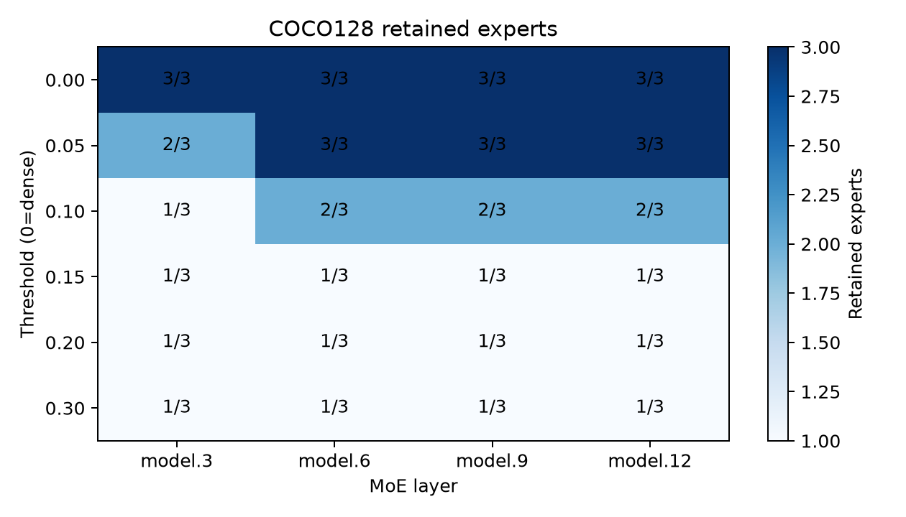
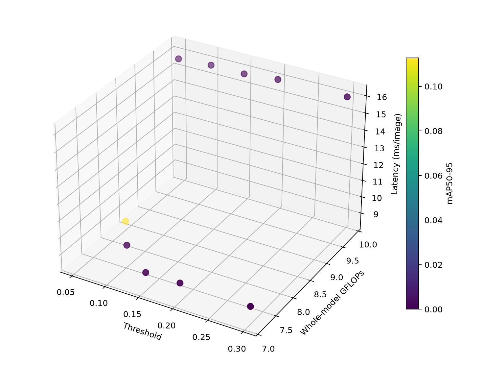
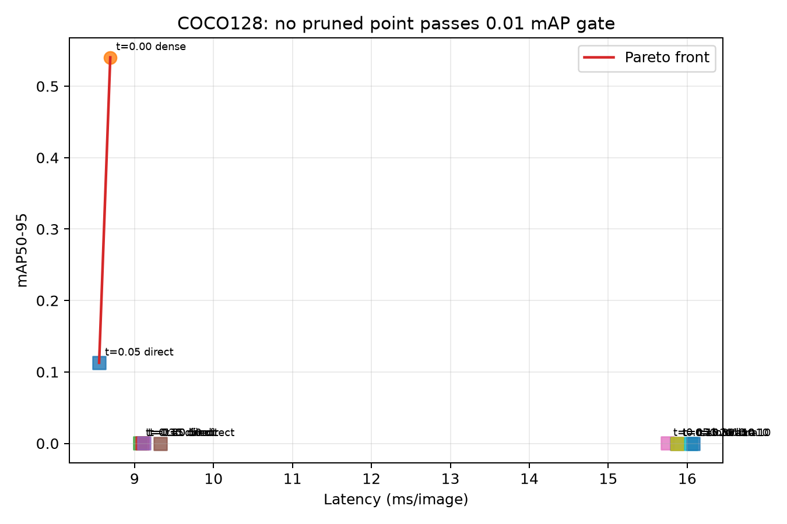
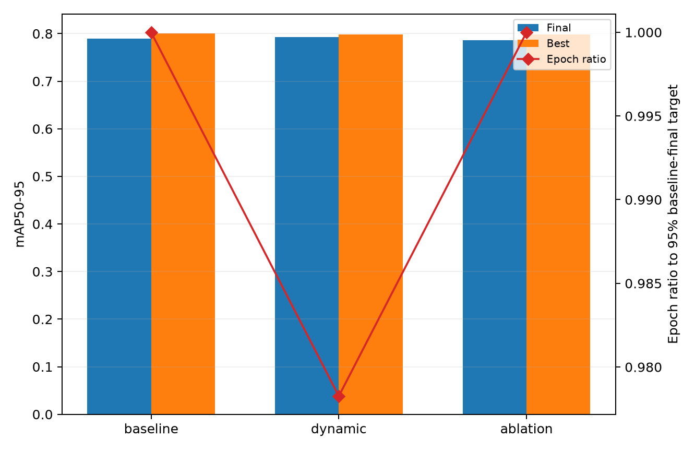
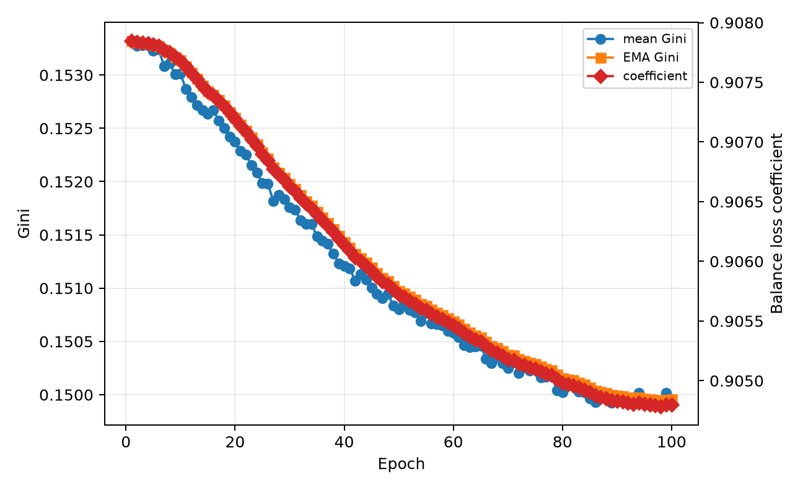

# Issue #52 技术总结：COCO128 上的 EsMoE 专家剪枝与动态调度

> 对应任务：[Tencent/YOLO-Master Issue #52](https://github.com/Tencent/YOLO-Master/issues/52)
>
> 实现分支：[vankari/YOLO-Master:moe-schedule-study](https://github.com/vankari/YOLO-Master/tree/moe-schedule-study)
>
> 数据声明：本文所有指标、CSV 和图片均由当前仓库在本机重新实验产生，不引用或复用其他 PR 的实验数据。

## 摘要

本文在同一份 `weights/YOLO-Master-EsMoE-N.pt` 上自行完成了两类 COCO128 实验：五档
`usage_weight` 专家剪枝（含 direct 验证和 LoRA 10 epoch 恢复），以及 fixed、Gini 动态、低平衡系数三组
100 epoch 训练消融。所有训练均使用 640 输入、batch 32、GPU 6、seed 42；原始 checkpoint 的直接验证
mAP50-95 为 0.54039，三组调度训练也都从该 checkpoint 的 811/811 权重项启动。

剪枝得到明确的负结果：阈值 0.05 仅删除 1/12 个专家槽，mAP50-95 已从 0.54039 降至 0.11281；阈值
0.10 及以上精度接近零。当前 LoRA 恢复路径又会按 YAML 重建为每层 3 个专家，已经不是结构保持的恢复。
以“mAP50-95 绝对下降不超过 0.01 且确实减少专家”为标准，本轮没有可部署的剪枝 Sweet Spot。

动态调度实验则验证了完整训练链路。Gini 组最终 mAP50-95 为 0.79255，比固定系数组高 0.00261；达到
固定组最终精度 95% 阈值的时间由第 46 epoch 提前到第 45 epoch。它说明实现有效并产生了不同轨迹，但
单 seed、单 epoch 的领先不足以证明稳定加速，需要多 seed 和更大数据集复验。

## 1. 数据来源与可复现链路

本文只使用下面两条本地实验链路：

~~~text
剪枝：
weights/YOLO-Master-EsMoE-N.pt
  -> scripts/run_issue52_full.py
  -> runs/issue52_coco128_corrected/pruning/results.csv
  -> reports/moe-pruning/coco128-*.csv
  -> reports/issue52-figs/coco128-*.png

动态调度：
weights/YOLO-Master-EsMoE-N.pt
  -> scripts/run_moe_dynamic_schedule_ablation.py
  -> runs/issue52_coco128_dynamic_selfrun_v2/{三组}/results.csv
  -> runs/issue52_coco128_dynamic_selfrun_v2/dynamic_schedule_summary.csv
  -> reports/moe-pruning/coco128-dynamic-*.csv
  -> reports/issue52-figs/coco128-dynamic-*.png
~~~

基线权重 SHA-256：
`29e1b93f09b16c8cf7c402f36dcaafc19d4812155631ed45b769e941e4c88c32`。

剪枝命令：

~~~bash
./yolo/bin/python scripts/run_issue52_full.py \
  --baseline-checkpoint weights/YOLO-Master-EsMoE-N.pt \
  --data coco128.yaml --device 6 --imgsz 640 --batch 32 --workers 4 \
  --thresholds 0.05 0.10 0.15 0.20 0.30 \
  --lora-epochs 10 --importance-mode usage_weight \
  --warmup 10 --runs 30 \
  --output runs/issue52_coco128_corrected \
  --skip-schedule
~~~

动态消融命令：

~~~bash
./yolo/bin/python scripts/run_moe_dynamic_schedule_ablation.py \
  --model weights/YOLO-Master-EsMoE-N.pt \
  --data ultralytics/cfg/datasets/coco128.yaml \
  --project runs/issue52_coco128_dynamic_selfrun_v2 \
  --epochs 100 --imgsz 640 --batch 32 --device 6 \
  --workers 4 --seed 42 --exist-ok
~~~

归档主表：[剪枝结果](./moe-pruning/coco128-pruning-results.csv)、
[逐层专家数](./moe-pruning/coco128-per-layer-experts.csv)、
[精度/延迟 Pareto](./moe-pruning/coco128-pareto-accuracy-latency.csv)、
[动态消融结果](./moe-pruning/coco128-dynamic-schedule-results.csv)、
[动态 Gini 轨迹](./moe-pruning/coco128-dynamic-gini-trace.csv)。

## 2. MoE、专家剪枝与动态超参数调度

Mixture-of-Experts（MoE）用多个专家子网络替换单一路径，router 根据输入特征给专家分配权重。本项目的
EsMoE-N 在 `model.3`、`model.6`、`model.9`、`model.12` 放置 4 个 `ES_MOE` 层，每层初始 3 个
专家。MoE 的收益依赖于专家分工、路由稳定性以及部署后端能否把结构稀疏转化为真实延迟下降，不能只看参数量。

本项目的专家剪枝流程为：

1. 在校准数据上注册 router tracker，累计专家命中次数和路由权重；
2. 使用 `usage_weight` 计算专家重要性；
3. 每层删除低于阈值的专家，同时保证至少保留 1 个；
4. 同步重建专家列表、router 输出通道、Top-k 和 usage buffer；
5. 重新验证结构、精度、GFLOPs、参数量与实际推理延迟。

动态超参数调度不改变专家数量，而是根据路由不均衡程度逐 epoch 调整 balance loss 系数。对非负专家
使用量向量 `x`，Gini 定义为：

~~~text
G(x) = sum_i sum_j |x_i - x_j| / (2 * n * sum_i x_i)
~~~

各 MoE 层先汇总真实 top-k 路由计数，再计算逐层 Gini 并求均值。为抑制单 epoch 噪声，调度器使用 EMA：

~~~text
ema_t = beta * ema_(t-1) + (1 - beta) * g_t

lambda_(t+1) = clip(
    lambda_base * exp(alpha * (ema_t - g_target)),
    lambda_min,
    lambda_max
)
~~~

路由过于集中时增大 balance loss，路由已经均衡时减小约束。实现支持 DDP 汇总、accepted epoch 更新、
checkpoint resume 和 CSV trace，默认关闭以保持原训练行为。

## 3. 实验配置

| 项目 | 配置 |
| --- | --- |
| 数据集 | COCO128，128 张图；适合功能与趋势实验，不代表完整 COCO 泛化 |
| 模型 | YOLO-Master-EsMoE-N，4 个 MoE 层，每层 3 专家 |
| 初始化 | `weights/YOLO-Master-EsMoE-N.pt`，训练时迁移 811/811 权重项 |
| 剪枝阈值 | 0.05、0.10、0.15、0.20、0.30 |
| 剪枝重要性 | `usage_weight` |
| 剪枝恢复 | direct；LoRA 10 epoch |
| 动态消融 | fixed 1.0；Gini 动态；fixed 0.3 |
| 动态训练 | 每组 100 epoch，三组共享相同 checkpoint 与 seed |
| 输入/批量 | imgsz 640，batch 32 |
| 设备 | NVIDIA RTX PRO 6000 Blackwell Server Edition 97 GB，device 6 |
| 随机种子 | 42 |
| 延迟测量 | warmup 10 次，正式测量 30 次，单位 ms/image |
| 质量门槛 | 相对 dense 的 mAP50-95 绝对下降不超过 0.01，且确实减少专家 |

COCO128 的训练集与验证集同源，本文将它用于代码链路验证、消融和错误暴露，不把单 seed 数值外推为
完整 COCO 或其他数据集的最终结论。

## 4. 五档专家剪枝结果

| Threshold | Stage | mAP50 | mAP50-95 | GFLOPs | Latency ms | Params M | 逐层专家数 |
| ---: | --- | ---: | ---: | ---: | ---: | ---: | --- |
| 0.00 | dense | 0.69991 | 0.54039 | 8.6540 | 8.692 | 2.6834 | 3 / 3 / 3 / 3 |
| 0.05 | direct | 0.14741 | 0.11281 | 8.3493 | 8.551 | 2.6775 | 2 / 3 / 3 / 3 |
| 0.05 | LoRA10 | 0.00149 | 0.00027 | 9.8636 | 15.750 | 2.9110 | 3 / 3 / 3 / 3（重建） |
| 0.10 | direct | 0.00000 | 0.00000 | 7.5318 | 9.323 | 2.5457 | 1 / 2 / 2 / 2 |
| 0.10 | LoRA10 | 0.00000 | 0.00000 | 9.8636 | 15.874 | 2.9110 | 3 / 3 / 3 / 3（重建） |
| 0.15 | direct | 0.00030 | 0.00010 | 7.1519 | 9.095 | 2.4335 | 1 / 1 / 1 / 1 |
| 0.15 | LoRA10 | 0.00000 | 0.00000 | 9.8636 | 15.865 | 2.9110 | 3 / 3 / 3 / 3（重建） |
| 0.20 | direct | 0.00030 | 0.00010 | 7.1519 | 9.119 | 2.4335 | 1 / 1 / 1 / 1 |
| 0.20 | LoRA10 | 0.00000 | 0.00000 | 9.8636 | 16.048 | 2.9110 | 3 / 3 / 3 / 3（重建） |
| 0.30 | direct | 0.00030 | 0.00010 | 7.1519 | 9.068 | 2.4335 | 1 / 1 / 1 / 1 |
| 0.30 | LoRA10 | 0.00000 | 0.00000 | 9.8636 | 16.075 | 2.9110 | 3 / 3 / 3 / 3（重建） |

直接剪枝的压缩是真实的，但质量代价不可接受：

- 0.05 仅减少 1/12 个专家槽，GFLOPs 下降 3.52%，mAP50-95 却绝对下降 0.42758；
- 0.10 的 GFLOPs 下降 12.97%，mAP50-95 已为 0；
- 0.15 以上把所有层压到 1 个专家，GFLOPs 下降 17.36%，精度近零；
- GPU 延迟没有随 GFLOPs 单调下降，当前路径受 kernel 调度与测量噪声影响，不能凭理论 FLOPs 宣称加速。

## 5. 逐层结构与 Pareto 分析

| Threshold | model.3 | model.6 | model.9 | model.12 |
| ---: | ---: | ---: | ---: | ---: |
| dense | 3/3 | 3/3 | 3/3 | 3/3 |
| 0.05 | 2/3 | 3/3 | 3/3 | 3/3 |
| 0.10 | 1/3 | 2/3 | 2/3 | 2/3 |
| 0.15 | 1/3 | 1/3 | 1/3 | 1/3 |
| 0.20 | 1/3 | 1/3 | 1/3 | 1/3 |
| 0.30 | 1/3 | 1/3 | 1/3 | 1/3 |

没有任何结构剪枝点通过 0.01 mAP50-95 质量门槛，因此 Sweet Spot 状态为 `not_observed`。数学上的
Pareto 点不等于可部署点；精度已经坍塌的低 FLOPs 模型不能只因不可支配就被推荐。

## 6. LoRA10 失败实验与原因

LoRA 日志显示恢复阶段只从剪枝 checkpoint 迁移约 747/811 或 801/811 个权重项，并提示 detection head
因 class mismatch 被重新初始化。更关键的是，恢复结果重新变成每层 3 个专家，参数量从 dense 的
2.683 M 升到 2.911 M，GFLOPs 从 8.654 升到 9.864。它已经不是原剪枝 module graph 上的低秩恢复。

本文保留这组本地负结果作为失败诊断。后续正确恢复方案应：

1. 在 pruned module graph 原位插入 adapter，不按原始 YAML 重建；
2. 锁定 detection head，仅在类别数确实变化时重新初始化；
3. 保存并校验每层专家索引、router 输出通道和 Top-k；
4. 恢复前后比较结构签名，再比较精度；
5. 使用更低学习率和多个 seed，报告 mean±std。

## 7. 本地 100 epoch 动态调度消融

三组都从相同 checkpoint 和 seed 启动，训练入口确认迁移 811/811 权重项：

| 组别 | Balance 策略 | Final mAP50-95 | Best mAP50-95 | Final mAP50 | 达到目标 epoch | 相对 fixed |
| --- | --- | ---: | ---: | ---: | ---: | ---: |
| baseline | 固定 1.0 | 0.78994 | **0.80103** | 0.91694 | 46 | 1.0000 |
| dynamic | Gini-EMA 动态 | **0.79255** | 0.79787 | **0.92148** | **45** | **0.9783** |
| ablation | 固定 0.3 | 0.78629 | 0.79842 | 0.92067 | 46 | 1.0000 |

“达到目标 epoch”的统一目标是 fixed 组最终 mAP50-95 的 95%，即 0.750443。Gini 动态组比 fixed 组
提前 1 epoch（2.17%），最终 mAP50-95 高 0.00261；但其 best mAP50-95 低 0.00316。固定 0.3 组最终
比 fixed 1.0 低 0.00365。这个结果支持“动态系数已经进入实际损失图并改变训练轨迹”，但不支持在单 seed
上宣称显著或稳定的收敛提升。

Gini 组 100 epoch 的 mean Gini 从 0.153321 降至 0.149961，EMA 对应降至 0.149957；balance loss
系数从 0.907848 平滑变化到 0.904799。每个 epoch 记录 4 个 MoE 层、512 次路由观测。

完整数值见[动态消融 CSV](./moe-pruning/coco128-dynamic-schedule-results.csv)和
[100 epoch Gini trace](./moe-pruning/coco128-dynamic-gini-trace.csv)。

## 8. 实验过程中发现并修复的问题

为了避免把无效实验写入结论，本轮先用小规模 probe 核对初始化与损失链路，再重新跑最终三组实验：

1. 动态消融脚本原先设置 `pretrained=False`，训练器会丢弃传入 `.pt` 权重。现改为
   `pretrained=True`，并由完整实验入口从已验证 baseline checkpoint 保存三组共享初始状态；日志确认
   迁移 811/811 权重项。
2. `ES_MOE._compute_load_balancing_loss()` 原先发布原始 GShard loss，`balance_loss_coeff` 只更新模块
   元数据，没有乘入训练损失图。因此三种系数会得到完全相同的曲线。现将系数乘入发布的 auxiliary loss，
   同时保留原始 loss buffer 供诊断，并增加 1.0/0.25 比例回归测试。
3. 结构剪枝后 `expert_usage_counts` buffer 长度未同步，导致 pruned checkpoint 验证异常。现随保留专家
   数重建 buffer，并增加剪枝后前向回归测试。

修复前产生的无效初始化或无效系数实验均未进入本文 CSV、图表和结论；`selfrun_v2` 才是报告引用的最终结果。

## 9. 动态调度的风险与后续实验

1. **系数振荡**：`beta` 太小会追随 batch 噪声，应记录 mean Gini、EMA 和 coefficient，并限制变化率。
2. **过度均衡**：Gini 越低不必然越好；专家完全同质化也会削弱 MoE，需要保留非零 target。
3. **辅助损失压制主任务**：`alpha` 或上限过大时可能牺牲检测精度，必须联合监控主损失与 mAP。
4. **DDP 偏差**：应先聚合各 rank 的 usage 再算 Gini，不能先各卡计算后简单平均。
5. **异常恢复污染**：只有 accepted epoch 才推进 EMA，NaN recovery epoch 的统计必须丢弃。
6. **统计显著性**：当前只有 seed 42；后续至少运行 3 个 seed，报告 mean±std 和到达目标 epoch 分布。
7. **数据规模**：COCO128 用于链路和趋势验证，最终结论需要完整数据集、独立验证集与真实部署后端。

## 10. 计算资源与部署建议

资源探测数据：[coco128-resource-profile.csv](./moe-pruning/coco128-resource-profile.csv)。

| Probe | 结果 |
| --- | --- |
| batch 128、imgsz 1600 | OOM，自动降低 batch 后最终为 16 |
| batch 36、imgsz 1344 | 稳定完成，peak allocated 87.28 GiB，reserved 92.89 GiB |

97 GB GPU 上，36/1344 比表面设置 128/1600、实际退化到 batch 16 更稳定。不同 GPU 应先做短 probe，
再选择能持续稳定运行的 batch 与分辨率。

服务器端与边缘端本轮都建议保留 dense checkpoint。0.05 的理论计算量只下降 3.52%，却损失 0.42758
mAP50-95；更高阈值直接坍塌。后续剪枝应优先研究逐层敏感度、训练期稀疏正则和结构保持 recovery，并在
TensorRT/ONNX 等真实导出后端测端到端延迟。

## 11. 涉及脚本与仓库链接

实验与分析：

- [Issue #52 一键实验入口](https://github.com/vankari/YOLO-Master/blob/moe-schedule-study/scripts/run_issue52_full.py)
- [本地 CSV/图片生成](https://github.com/vankari/YOLO-Master/blob/moe-schedule-study/scripts/build_issue52_report_assets.py)
- [独立专家剪枝扫描](https://github.com/vankari/YOLO-Master/blob/moe-schedule-study/scripts/moe_pruning_sweep.py)
- [阈值/Pareto 绘图](https://github.com/vankari/YOLO-Master/blob/moe-schedule-study/scripts/plot_moe_pruning_sweep.py)
- [动态调度三组消融](https://github.com/vankari/YOLO-Master/blob/moe-schedule-study/scripts/run_moe_dynamic_schedule_ablation.py)

核心实现：

- [MoEPruner](https://github.com/vankari/YOLO-Master/blob/moe-schedule-study/ultralytics/nn/modules/moe/pruning.py)
- [ES_MOE balance loss](https://github.com/vankari/YOLO-Master/blob/moe-schedule-study/ultralytics/nn/modules/moe/modules.py)
- [Gini 调度器](https://github.com/vankari/YOLO-Master/blob/moe-schedule-study/ultralytics/nn/modules/moe/schedule.py)
- [训练生命周期与路由聚合](https://github.com/vankari/YOLO-Master/blob/moe-schedule-study/ultralytics/engine/extensions/mixture.py)
- [动态调度测试](https://github.com/vankari/YOLO-Master/blob/moe-schedule-study/tests/test_moe_dynamic_schedule.py)

重新生成归档和图片：

~~~bash
./yolo/bin/python scripts/build_issue52_report_assets.py
~~~

## 12. 结论

本报告的全部证据来自本仓库自行运行的 COCO128 实验。五档 `usage_weight` 剪枝没有任何点通过 0.01
mAP50-95 质量门槛，LoRA10 也没有保持剪枝结构，因此当前不能推荐结构剪枝部署点。

动态 Gini 调度在修复 checkpoint 初始化和 balance loss 接线后完成了本地 100 epoch 三组消融。动态组
最终 mAP50-95 为 0.79255，比固定组高 0.00261，并提前 1 epoch 达到统一目标；这足以证明调度链路有效，
但不足以从单 seed 宣称稳定加速。下一步应进行多 seed、完整数据集和真实部署后端验证。
