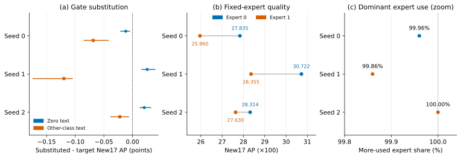
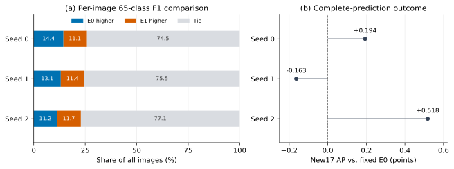

# 同一检查点的门控与专家选择干预

这组补充实验针对主报告留下的归因问题：文本改变专家评分后，检测质量的变化来自专家编号，还是来自所选专家输出的连续权重？实验复用三组文本路由检查点和固定的 COCO val2017 5,000 图顺序，不重新训练模型。每张图像单独前向，分类头始终使用相同的 65 类文本；变化只发生在适配器的专家编号或输出权重。

## 条件定义

原生路由先为每张图像计算真实目标文本下的专家编号 `aT`、两位专家分数 `pT` 和所选分数 `gT`。零文本、错类文本产生 `pZ`、`pW`，但不改变分类头文本。

| 条件 | 专家编号 | 输出权重 | 用途 |
| --- | --- | --- | --- |
| `T_NATIVE` | 原生 `aT` | 原生 `gT` | 未修改实现的校验对照 |
| `T` | 原生 `aT` | 原生 `gT` | 干预实现中的基准 |
| `GZ` | 固定为 `aT` | `pZ[aT]` | 只替换为零文本 gate |
| `GW` | 固定为 `aT` | `pW[aT]` | 只替换为错类文本 gate |
| `E0` / `E1` | 全部固定为专家 0 / 1 | 原生 `gT` | 比较专家整体质量 |
| `FZ` / `FW` | 固定为 `1-aT` | `pZ[aT]` / `pW[aT]` | 探索编号与 gate 的交互 |
| `FT` | 逐图选择 `1-aT` 的完整 `E0/E1` 预测 | 对应固定专家条件 | 派生的原生反向选择 |

三组检查点各运行八个直接条件，共 24 次完整评测。`FT` 从 `E0/E1` 的完整预测逐图组装，不是第九次模型前向。相同方法按 `aT` 重建 `T`，三组检查点的逐图预测失配数均为 0；`T` 与 `T_NATIVE` 的 AP 也完全相同。

## 主要结果

下表报告完整 5,000 图的 New17 AP 点差。点估计来自原始完整评测；区间来自 1,000 次配对图像重采样，两者分开保存于 [`conditions.csv`](conditions.csv) 和 [`paired_bootstrap.csv`](paired_bootstrap.csv)。区间是逐比较描述，未做多重比较校正。

| seed | `GZ−T` | `GW−T` | `E1−E0` | `FT−T` | 原生 E0 / E1 图数 |
| --- | ---: | ---: | ---: | ---: | ---: |
| 0 | −0.0117 | −0.0686 | −1.8747 | −1.8747 | 4998 / 2 |
| 1 | +0.0256 | −0.1198 | −2.3668 | +2.3648 | 7 / 4993 |
| 2 | +0.0205 | −0.0221 | −0.6843 | +0.6843 | 0 / 5000 |



固定专家编号后，错类文本 gate 相对真实文本 gate 在三组检查点中都降低 New17 AP；零文本 gate 的方向为一负两正。这说明连续 gate 在这些固定检查点上能独立改变检测质量，同时不支持“真实文本 gate 稳定优于零文本 gate”。

在相同逐图 `gT` 下，专家 0 的整体 New17 AP 在三组检查点中都高于专家 1。原生路由在 seed 1 和 seed 2 却几乎全部选择专家 1；对应的反向选择 `FT` 分别提高 +2.3648 和 +0.6843 AP 点。这个结果把先前的“文本响应未形成稳定收益”进一步定位到选择与已训练专家质量未对齐；专家编号只在各自检查点内有意义，不能给专家 0 赋予跨训练的固定功能语义。

`FZ/FW` 的交互项也保存在配对统计表中。它们没有形成三组检查点一致的模式，因此只作为探索性结果，不升级为机制结论。

### 局部专家机会是否能变成目标指标收益

为检验两个固定专家是否在不同图像上具有互补性，我们另做逐图诊断：对置信度不低于 0.25 的 65 类预测，以 IoU≥0.5 做同类 COCO 式匹配，分别计算 `E0/E1` 的图像级 F1。真实标注只用于离线选择当图 F1 更高的专家；随后从该专家的完整、置信度不低于 0.001 的预测中组装结果，再计算标准 COCO AP。

诊断匹配在公开前修复了 COCO `xywh` 框解释以及 `ignore/crowd` 处理，并以 9 个红/绿夹具和 8 组 `pycocotools` 普通/`crowd` IoU 对照复核。旧诊断输出不进入本目录。修正后的结果见 [`opportunity_summary.csv`](opportunity_summary.csv)。

| seed | F1 不同的图像 | 相对最佳固定专家的改选 | 平均 F1 增量 | 诊断选择−最佳固定 New17 AP |
| --- | ---: | ---: | ---: | ---: |
| 0 | 1277 | 555 | +0.01706 | +0.1938 AP 点 |
| 1 | 1227 | 570 | +0.01485 | −0.1632 AP 点 |
| 2 | 1145 | 584 | +0.01737 | +0.5181 AP 点 |



三个检查点的逐图 F1 都存在非零机会和改选动作，但完整 New17 AP 相对最佳固定专家为两正一负，没有形成三组一致收益，平均点差也低于预先采用的 +0.5 AP 点目标。这个选择器使用真实标注，只回答“当前两个专家是否存在可测的局部互补”；它不优化 AP，不是可部署路由器，也不构成所有自适应策略的 AP 上界。结果支持保留选择质量问题，同时不支持立即扩大路由机制或追加训练。

## 复现与边界

运行下面的纯 Python 脚本会先检查 24 条件是否完整、`T/T_NATIVE` 是否一致、主要 AP 点差能否由条件表复算、每组统计是否含 1,000 个重复，以及逐图机会计数能否完整覆盖 5,000 图，再生成两张 SVG：

```bash
python scripts/plot_b1_controlled_interventions.py
```

[`protocol.json`](protocol.json) 记录实际 batch、软件、输入和脚本身份边界。早期列表输入导致实际 batch 为 500 的尝试不进入这组结果；本目录只使用逐图字符串输入、实际 batch 为 1 的规范矩阵。`conditions.csv` 中的冷/暖时延和内存来自非独占运行窗口，只是执行观察，不用于正式加速、延迟或 Pareto 声明。

补充实验没有训练新模型，也没有把三个检查点当作新的独立训练重复。它检验的是既有检查点上的干预响应。类别级专家功能、不同结构或粒度的专家、可部署选择器和跨任务收益仍需单独研究。
